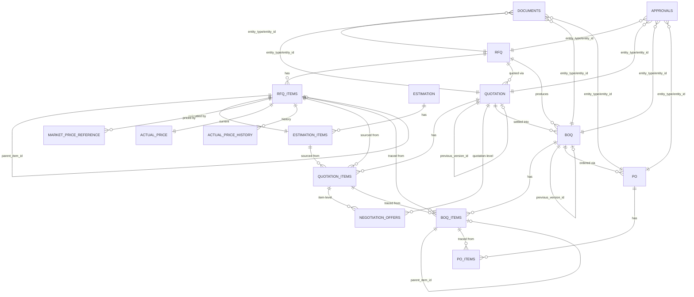
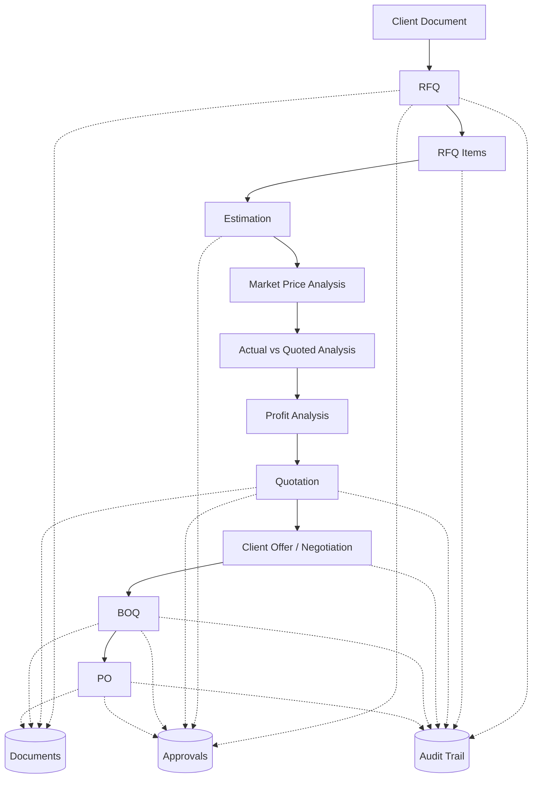

# SAV ERP — Commercial Lifecycle Module
## RFQ → Estimation → Market Price Analysis → Actual vs Quoted → Profit Analysis → Quotation → Client Offer/Negotiation → BOQ → PO
### Database Architecture Specification (PostgreSQL / Supabase)

**Convention note:** This module inherits the SAV ERP standing conventions — UUID v4 (`gen_random_uuid()`) primary keys, `company_id`/`branch_id` on every table, soft delete via `deleted_at` (never hard-delete), standard audit columns (`created_at`, `created_by`, `updated_at`, `updated_by`, `deleted_at`, `deleted_by`, plus `company_id`/`branch_id`) on all Core/Master/Transaction tables, a lighter audit set on Lookup tables, and append-only History/Audit/Log tables. Table prefix for this module: `com_` (Commercial). No AI/LLM/OCR extraction is included anywhere in this design — document upload is manual, structured-data entry is manual.

---

## PHASE 1 — BUSINESS WORKFLOW ANALYSIS

### 1.1 Complete Workflow

```
CLIENT SENDS RFQ DOCUMENT
   → SAV user uploads original document(s) (com_documents)
   → User manually reads document and enters structured RFQ + RFQ item data
   → RFQ (com_rfq) + RFQ Items (com_rfq_items) created, hierarchical S.No structure
   → Item-level Estimation (com_estimation / com_estimation_items) — one cost build-up per S.No
   → Market Price Analysis (com_market_price_reference) — one or more reference prices per S.No, source-tagged
   → Actual Price is set/selected per S.No (com_actual_price + com_actual_price_history)
   → Quotation is drafted (com_quotation / com_quotation_items) referencing RFQ item + Estimation item;
     Quoted Price is captured per S.No item, versioned (never overwritten)
   → Actual vs Quoted variance + Profit are DERIVED (view), not duplicated storage
   → Quotation is submitted to client → Client Offer / Negotiation begins
     (com_negotiation_offers — full offer/counter-offer history, quotation-level or item-level)
   → Final Agreed Price emerges as the last "Final" status offer per item (or quotation)
   → Tentative BOQ, then Final BOQ, is produced from the settled commercial position
     (com_boq / com_boq_items, versioned, hierarchical S.No)
   → Purchase Order is raised against BOQ (com_po / com_po_items)
   → Approvals (com_approvals) and Audit Trail (com_audit_log) apply at every stage
```

### 1.2 Actors

| Actor | Responsibility |
|---|---|
| Estimation Engineer | Enters RFQ items, builds item-level cost estimation |
| Commercial/Costing Team | Enters market price references, sets actual price, calculates profit |
| Sales/Commercial Manager | Prepares and revises quotations, records client offers/negotiation |
| Approver(s) | Approves RFQ, Estimation, Quotation, Final Commercial Decision, BOQ, PO |
| Project/Procurement Team | Converts final BOQ into Purchase Orders |
| Admin/System | Maintains audit trail, document versioning, status transitions |

### 1.3 Major Entities

RFQ, RFQ Item (hierarchical), Estimation, Estimation Item (+cost build-up), Market Price Reference, Actual Price (+history), Quotation (versioned), Quotation Item, Negotiation Offer, BOQ (versioned), BOQ Item, Purchase Order, PO Item, Document, Approval, Audit Log.

### 1.4 Key Relationships (summary)

- One RFQ → many RFQ Items (self-referencing parent/child hierarchy)
- One RFQ Item → one Estimation Item (1:1, per S.No)
- One RFQ Item / Estimation Item → many Market Price References (1:many, historical)
- One RFQ Item → one *current* Actual Price + many Actual Price History rows (1:many, append-only)
- One RFQ Item → many Quotation Items across quotation versions (1:many)
- One Quotation Item → many Negotiation Offers (1:many, append-only)
- One Quotation Item (settled) → one BOQ Item (1:1, per version)
- One BOQ Item → one PO Item (1:1, typically; PO can also reference BOQ item without a strict 1:1 if partial ordering is needed — see §6 business rules)
- Documents, Approvals, Audit Log are polymorphic/reusable across all the above via `entity_type` + `entity_id`

### 1.5 Business Rules (high level)

1. Estimation, market price, actual price, quoted price, profit, negotiation, BOQ and PO are all analyzed **per RFQ item (S.No)**, never only at RFQ/project total.
2. S.No (`item_code`) is a **display/business identifier only** — never a primary key. Hierarchy is enforced via `parent_item_id` self-reference.
3. Quotation, BOQ, and Documents are **versioned, append-only** — a new version is a new row; nothing is overwritten.
4. Negotiation offers are **append-only** — every offer/counter-offer is a new row.
5. Actual price is **not overwritten** — every change creates a new `com_actual_price_history` row and updates the pointer in `com_actual_price`.
6. BOQ `description` is capped at 50 words, enforced at the API layer (word-count validation) and mirrored with a DB CHECK constraint as a safety net.
7. All monetary columns use `NUMERIC(18,2)` (or `NUMERIC(14,4)` for rates where sub-unit precision matters) — never `FLOAT`/`REAL`.
8. Derived values (rate difference, %, profit, margin) are **calculated**, not stored, except where explicitly noted for reporting-performance reasons (see Phase 8 and Phase 29-equivalent discussion in Phase 6).

### 1.6 Data Ownership / External Dependencies

Treated as **existing SAV master tables**, referenced by FK only, never duplicated:
`clients`, `projects`, `sites`, `users`, `employees`, `vendors` (from Module 04 Client/Vendor Management), `currencies`, `taxes`, `companies`, `branches`.

---

## PHASE 2 — ITEM-LEVEL BUSINESS LOGIC (ONE S.No WALKTHROUGH)

**Example S.No: `2.1(a)` — "Excavation in ordinary soil up to 1.5m depth"**

1. **RFQ**: Client RFQ document uploaded → `com_documents` row created, linked to `com_rfq`. User reads document, creates `com_rfq_items` row: `item_code='2.1(a)'`, `parent_item_id` → row for `2.1`, `quantity=500`, `unit='m3'`.
2. **Estimation**: `com_estimation_items` row created referencing the RFQ item: material ₹40, labour ₹90, equipment ₹30, subcontract ₹0, transport ₹10, other ₹5, overhead ₹5, contingency ₹0 → `estimated_unit_cost = 180`. `estimated_total_cost = 500 × 180 = 90,000`.
3. **Market Price Analysis**: multiple `com_market_price_reference` rows for the same item: current market ₹195, internal purchase ₹185, previous project rate ₹175 — each dated and sourced.
4. **Actual Price**: costing team sets Actual Price = ₹180 (basis = "Approved Estimation Rate"), source reference → the estimation row. Written to `com_actual_price` (current pointer) + `com_actual_price_history` (row 1).
5. **Quoted Price**: Quotation v1 created → `com_quotation_items` row for `2.1(a)`: `quoted_rate = 210`. `quoted_value = 500 × 210 = 105,000` (derived).
6. **Actual vs Quoted (derived, via view)**: rate difference `= 210 − 180 = 30` (+16.67%); value difference `= 105,000 − 90,000 = 15,000` (+16.67%).
7. **Profit (derived)**: profit `= 105,000 − 90,000 = 15,000`; margin `= 15,000/105,000 = 14.29%`.
8. **Client Offer / Negotiation**: `com_negotiation_offers` rows, item-level, `quotation_item_id → 2.1(a)`: SAV 210 → Client 190 → SAV counter 205 → Client 200 → **Final 202** (`is_final=true`).
9. **Final Agreed Price (derived from the final offer)**: 202. Final profit `= 500×202 − 90,000 = 11,000`; final margin `= 11,000/101,000 = 10.89%`.
10. **BOQ**: `com_boq_items` row created for `2.1(a)` in the Tentative BOQ, `unit_rate = 202` (copied from the final negotiation outcome at BOQ-creation time — a deliberate point-in-time snapshot, see Phase 6), `source_rfq_item_id` and `source_quotation_item_id` both set.
11. **PO**: once BOQ is Final, `com_po_items` row created referencing `com_boq_items(2.1(a))`, `rate = 202` (or a further-negotiated procurement rate if applicable — PO rate is independent and traceable back to BOQ rate).

---

## PHASE 3 — MODULE ARCHITECTURE

```
RFQ
 ↓
ESTIMATION (per item)
 ↓
MARKET PRICE ANALYSIS (per item, multi-source)
 ↓
ACTUAL PRICE  ──┐
                ├──►  ACTUAL vs QUOTED (derived view)  ──►  PROFIT ANALYSIS (derived view)
QUOTED PRICE ───┘
 ↓
QUOTATION (versioned)
 ↓
CLIENT OFFER / NEGOTIATION (append-only history)
 ↓
FINAL AGREED PRICE (derived: latest is_final offer)
 ↓
BOQ (Tentative → Final, versioned)
 ↓
PURCHASE ORDER

Cross-cutting: DOCUMENTS · APPROVALS · AUDIT TRAIL · VERSIONING  (attach to every stage above)
```

---

## PHASE 4 — COMPLETE TABLE INVENTORY

| # | Table | Purpose | Category |
|---|---|---|---|
| 1 | `com_rfq` | RFQ header per client requirement | Core |
| 2 | `com_rfq_items` | Hierarchical RFQ line items (S.No) | Core |
| 3 | `com_estimation` | Estimation header per RFQ | Core |
| 4 | `com_estimation_items` | Item-level cost build-up per S.No | Core |
| 5 | `com_market_price_reference` | Multi-source market price records per item | Core |
| 6 | `com_actual_price` | Current actual price pointer per item | Core |
| 7 | `com_actual_price_history` | Append-only actual price history | Supporting (History) |
| 8 | `com_quotation` | Quotation header, versioned | Core |
| 9 | `com_quotation_items` | Quotation line items per S.No, per version | Core |
| 10 | `com_negotiation_offers` | Append-only offer/counter-offer history | Core |
| 11 | `com_boq` | BOQ header, versioned (Tentative/Final) | Core |
| 12 | `com_boq_items` | Hierarchical BOQ line items | Core |
| 13 | `com_po` | Purchase Order header | Core |
| 14 | `com_po_items` | PO line items | Core |
| 15 | `com_documents` | Polymorphic document metadata (Supabase Storage) | Supporting |
| 16 | `com_approvals` | Reusable polymorphic approval records | Supporting |
| 17 | `com_audit_log` | Append-only audit trail (polymorphic) | Supporting (Log) |
| 18 | `com_item_category` | Lookup: BOQ/RFQ work categories (Soil Testing, Earthwork, etc.) | Lookup |
| 19 | `com_price_source_type` | Lookup: market price source types | Lookup |
| 20 | `com_document_category` | Lookup: document categories | Lookup |
| — | `v_item_commercial_analysis` | Derived VIEW — full per-S.No traceability & calculations | Derived (View) |
| — | `v_estimation_item_cost` | Derived VIEW — estimation cost roll-up per item | Derived (View) |
| — | `clients`, `projects`, `sites`, `users`, `employees`, `vendors`, `currencies`, `taxes`, `companies`, `branches` | Existing SAV masters | External Dependency |

---

## PHASE 5 — COMPLETE TABLE-BY-TABLE SCHEMA

Legend: PK=Primary Key, FK=Foreign Key, U=Unique, IDX=Indexed. Standard audit columns (`created_at TIMESTAMPTZ NOT NULL DEFAULT now()`, `created_by UUID NOT NULL FK→users`, `updated_at TIMESTAMPTZ NOT NULL DEFAULT now()`, `updated_by UUID FK→users`, `deleted_at TIMESTAMPTZ`, `deleted_by UUID FK→users`, `company_id UUID NOT NULL FK→companies`, `branch_id UUID FK→branches`) are implied on every Core/Supporting table below and omitted from the row listing for brevity except where a table needs a *different* pattern (Lookup, History, Log — noted explicitly).

### 5.1 `com_rfq`
| Column | Type | Null | Default | Key | Description |
|---|---|---|---|---|---|
| rfq_id | UUID | N | gen_random_uuid() | PK | Internal identifier |
| rfq_number | VARCHAR(50) | N | | U, IDX | Business RFQ number |
| client_id | UUID | N | | FK→clients, IDX | Client master |
| project_id | UUID | N | | FK→projects, IDX | Project master |
| site_id | UUID | | | FK→sites | Site master |
| rfq_date | DATE | N | | | Date RFQ received |
| scope_of_work | TEXT | | | | Free-text scope |
| execution_timeline | TEXT | | | | Client-stated timeline |
| payment_terms | TEXT | | | | Client-stated payment terms |
| status | com_rfq_status (ENUM) | N | 'Draft' | IDX | Draft/Received/Under Review/Under Estimation/Quotation Prepared/Submitted/Negotiation/Won/Lost/Cancelled/Expired |
| remarks | TEXT | | | | |

### 5.2 `com_rfq_items`
| Column | Type | Null | Default | Key | Description |
|---|---|---|---|---|---|
| rfq_item_id | UUID | N | gen_random_uuid() | PK | Internal ID |
| rfq_id | UUID | N | | FK→com_rfq, IDX | Parent RFQ |
| parent_item_id | UUID | | | FK→com_rfq_items (self), IDX | Hierarchy parent |
| item_code | VARCHAR(30) | N | | IDX | Business S.No, e.g. `2.1(a)` |
| category_id | UUID | | | FK→com_item_category | Work category |
| description | TEXT | N | | | Item description (source, unrestricted length — this is the RFQ item, not the BOQ description) |
| unit | VARCHAR(20) | N | | | UOM |
| quantity | NUMERIC(18,3) | N | | | Quantity (CHECK > 0) |
| sequence_no | INTEGER | N | | | Display order among siblings |
| remarks | TEXT | | | | |

### 5.3 `com_estimation`
| Column | Type | Null | Default | Key | Description |
|---|---|---|---|---|---|
| estimation_id | UUID | N | gen_random_uuid() | PK | |
| rfq_id | UUID | N | | FK→com_rfq, IDX | |
| estimation_number | VARCHAR(50) | N | | U | |
| status | com_estimation_status (ENUM) | N | 'Draft' | IDX | Draft/In Progress/Submitted for Approval/Approved/Rejected/Revised |
| prepared_by | UUID | N | | FK→users | |
| remarks | TEXT | | | | |

### 5.4 `com_estimation_items`
| Column | Type | Null | Default | Key | Description |
|---|---|---|---|---|---|
| estimation_item_id | UUID | N | gen_random_uuid() | PK | |
| estimation_id | UUID | N | | FK→com_estimation, IDX | |
| rfq_item_id | UUID | N | | FK→com_rfq_items, U, IDX | 1:1 with RFQ item |
| material_cost | NUMERIC(18,2) | N | 0 | | |
| labour_cost | NUMERIC(18,2) | N | 0 | | |
| equipment_cost | NUMERIC(18,2) | N | 0 | | |
| subcontract_cost | NUMERIC(18,2) | N | 0 | | |
| transportation_cost | NUMERIC(18,2) | N | 0 | | |
| other_direct_cost | NUMERIC(18,2) | N | 0 | | |
| overhead_cost | NUMERIC(18,2) | N | 0 | | |
| contingency_cost | NUMERIC(18,2) | N | 0 | | |
| estimated_unit_cost | NUMERIC(18,4) | N | | GENERATED ALWAYS AS (sum of above) STORED | Derived, stored for query performance |
| estimated_total_cost | NUMERIC(18,2) | N | | GENERATED ALWAYS AS (estimated_unit_cost × rfq quantity — see note) STORED/trigger | See Phase 6 note on generated columns across tables |
| remarks | TEXT | | | | |

*Note:* `estimated_total_cost` needs `quantity` from `com_rfq_items`; a GENERATED column cannot reference another table, so this is maintained via an `AFTER INSERT/UPDATE` trigger (or simply left as a derived view column — recommended: **keep unit cost stored, compute total cost in the view** to avoid trigger complexity). Final recommendation adopted in Phase 6.

### 5.5 `com_market_price_reference`
| Column | Type | Null | Default | Key | Description |
|---|---|---|---|---|---|
| market_price_id | UUID | N | gen_random_uuid() | PK | |
| rfq_item_id | UUID | N | | FK→com_rfq_items, IDX | |
| source_type_id | UUID | N | | FK→com_price_source_type, IDX | Current Market/Vendor/Internal Purchase/Historical Project/Historical Market/Other |
| source_reference | VARCHAR(200) | | | | Free text — vendor name, project name, quote no. |
| rate | NUMERIC(18,4) | N | | | |
| unit | VARCHAR(20) | N | | | |
| currency_id | UUID | N | | FK→currencies | |
| price_date | DATE | N | | IDX | Date the price is valid as of |
| remarks | TEXT | | | | |

*(This table is naturally append-only — every new market observation is a new row; nothing is ever updated.)*

### 5.6 `com_actual_price` (current pointer)
| Column | Type | Null | Default | Key | Description |
|---|---|---|---|---|---|
| actual_price_id | UUID | N | gen_random_uuid() | PK | |
| rfq_item_id | UUID | N | | FK→com_rfq_items, U, IDX | One current actual price per item |
| actual_rate | NUMERIC(18,4) | N | | | Current effective actual rate |
| unit | VARCHAR(20) | N | | | |
| currency_id | UUID | N | | FK→currencies | |
| price_basis | com_price_basis (ENUM) | N | | | Current Market/Vendor Price/Internal Purchase/Historical Project/Approved Estimation Rate/Other |
| price_source_reference | VARCHAR(200) | | | | e.g. FK-like text pointer to `com_market_price_reference.market_price_id` or `com_estimation_items.estimation_item_id` |
| price_date | DATE | N | | | |
| remarks | TEXT | | | | |

### 5.7 `com_actual_price_history` (append-only)
| Column | Type | Null | Default | Key | Description |
|---|---|---|---|---|---|
| actual_price_history_id | UUID | N | gen_random_uuid() | PK | |
| rfq_item_id | UUID | N | | FK→com_rfq_items, IDX | |
| actual_rate | NUMERIC(18,4) | N | | | Snapshot at time of change |
| price_basis | com_price_basis (ENUM) | N | | | |
| price_source_reference | VARCHAR(200) | | | | |
| price_date | DATE | N | | | |
| changed_by | UUID | N | | FK→users | |
| changed_at | TIMESTAMPTZ | N | now() | IDX | |
| remarks | TEXT | | | | |
*(Lighter audit set: no `updated_*`/`deleted_*` — this table is strictly append-only.)*

### 5.8 `com_quotation`
| Column | Type | Null | Default | Key | Description |
|---|---|---|---|---|---|
| quotation_id | UUID | N | gen_random_uuid() | PK | |
| rfq_id | UUID | N | | FK→com_rfq, IDX | |
| project_id | UUID | N | | FK→projects | |
| client_id | UUID | N | | FK→clients | |
| quotation_number | VARCHAR(50) | N | | IDX | Stable across versions |
| version_no | INTEGER | N | 1 | | 1, 2, 3… |
| previous_version_id | UUID | | | FK→com_quotation (self) | Links to prior version, never overwritten |
| quotation_date | DATE | N | | | |
| validity_date | DATE | | | | |
| status | com_quotation_status (ENUM) | N | 'Draft' | IDX | Draft/Under Approval/Approved/Submitted/Revised/Accepted/Rejected/Expired/Cancelled |
| payment_terms | TEXT | | | | |
| execution_period | TEXT | | | | |
| inclusions | TEXT | | | | |
| exclusions | TEXT | | | | |
| commercial_terms | TEXT | | | | |
| subtotal_amount | NUMERIC(18,2) | | | | Roll-up (view or trigger-maintained) |
| tax_amount | NUMERIC(18,2) | | 0 | | |
| total_amount | NUMERIC(18,2) | | | | |
| remarks | TEXT | | | | |
UNIQUE (`quotation_number`, `version_no`)

### 5.9 `com_quotation_items`
| Column | Type | Null | Default | Key | Description |
|---|---|---|---|---|---|
| quotation_item_id | UUID | N | gen_random_uuid() | PK | |
| quotation_id | UUID | N | | FK→com_quotation, IDX | |
| rfq_item_id | UUID | N | | FK→com_rfq_items, IDX | Traceability |
| estimation_item_id | UUID | | | FK→com_estimation_items, IDX | Traceability (nullable — quotation can exist before/without formal estimation link in edge cases) |
| item_code | VARCHAR(30) | N | | | Denormalized S.No for display/versioned snapshot |
| quantity | NUMERIC(18,3) | N | | | Snapshot quantity at this version |
| unit | VARCHAR(20) | N | | | |
| quoted_rate | NUMERIC(18,4) | N | | | |
| quoted_amount | NUMERIC(18,2) | N | | GENERATED ALWAYS AS (quantity × quoted_rate) STORED | |
| tax_percentage | NUMERIC(5,2) | | 0 | | |
| remarks | TEXT | | | | |

### 5.10 `com_negotiation_offers` (append-only)
| Column | Type | Null | Default | Key | Description |
|---|---|---|---|---|---|
| offer_id | UUID | N | gen_random_uuid() | PK | |
| quotation_id | UUID | N | | FK→com_quotation, IDX | Quotation-level negotiation |
| quotation_item_id | UUID | | | FK→com_quotation_items, IDX | Item-level negotiation (nullable — see business rule) |
| offer_type | com_offer_type (ENUM) | N | | | SAV_Quote/Client_Offer/SAV_Counter/Client_Counter/Final |
| offered_amount | NUMERIC(18,2) | | | | Quotation-level total offer |
| offered_rate | NUMERIC(18,4) | | | | Item-level offer rate |
| offered_by | com_offer_party (ENUM) | N | | | SAV / Client |
| offer_date | TIMESTAMPTZ | N | now() | IDX | |
| response_status | com_offer_response_status (ENUM) | N | 'Pending' | | Pending/Accepted/Rejected/Countered |
| payment_terms | TEXT | | | | |
| validity_date | DATE | | | | |
| commercial_conditions | TEXT | | | | |
| is_final | BOOLEAN | N | false | IDX | Marks the settled final offer |
| remarks | TEXT | | | | |
CHECK: exactly one of `offered_amount` (quotation-level) or `offered_rate` (item-level) is set, matching whether `quotation_item_id` is null.
*(Lighter audit: `created_at`, `created_by` only — never updated or deleted; corrections are new rows.)*

### 5.11 `com_boq`
| Column | Type | Null | Default | Key | Description |
|---|---|---|---|---|---|
| boq_id | UUID | N | gen_random_uuid() | PK | |
| boq_number | VARCHAR(50) | N | | IDX | Stable across versions |
| version_no | INTEGER | N | 1 | | |
| previous_version_id | UUID | | | FK→com_boq (self) | |
| boq_title | VARCHAR(200) | N | | | |
| project_id | UUID | N | | FK→projects | |
| client_id | UUID | N | | FK→clients | |
| site_id | UUID | | | FK→sites | |
| rfq_id | UUID | N | | FK→com_rfq, IDX | |
| quotation_id | UUID | | | FK→com_quotation, IDX | Source quotation version this BOQ was drawn from |
| boq_type | com_boq_type (ENUM) | N | 'Tentative' | IDX | Tentative/Final |
| status | com_boq_status (ENUM) | N | 'Draft' | IDX | Draft/Tentative/Under Review/Approved/Final/Revised/Cancelled |
| revision_reason | TEXT | | | | Required when `previous_version_id` is set |
| remarks | TEXT | | | | |
UNIQUE (`boq_number`, `version_no`)

### 5.12 `com_boq_items`
| Column | Type | Null | Default | Key | Description |
|---|---|---|---|---|---|
| boq_item_id | UUID | N | gen_random_uuid() | PK | |
| boq_id | UUID | N | | FK→com_boq, IDX | |
| parent_item_id | UUID | | | FK→com_boq_items (self), IDX | Hierarchy |
| category_id | UUID | | | FK→com_item_category | |
| item_code | VARCHAR(30) | N | | IDX | S.No |
| description | TEXT | N | | CHECK (word count ≤ 50) | **Field name is `description`, NOT `works_to_be_done`.** See Phase 8/10. |
| description_word_count | SMALLINT | N | | | Denormalized for fast filtering/reporting |
| unit | VARCHAR(20) | N | | | |
| quantity | NUMERIC(18,3) | N | | | |
| unit_rate | NUMERIC(18,4) | N | | | Point-in-time snapshot of the settled rate |
| amount | NUMERIC(18,2) | N | | GENERATED ALWAYS AS (quantity × unit_rate) STORED | |
| sequence_no | INTEGER | N | | | |
| source_rfq_item_id | UUID | | | FK→com_rfq_items, IDX | Traceability |
| source_quotation_item_id | UUID | | | FK→com_quotation_items, IDX | Traceability |
| remarks | TEXT | | | | |

### 5.13 `com_po`
| Column | Type | Null | Default | Key | Description |
|---|---|---|---|---|---|
| po_id | UUID | N | gen_random_uuid() | PK | |
| po_number | VARCHAR(50) | N | | U, IDX | |
| po_date | DATE | N | | | |
| vendor_id | UUID | N | | FK→vendors, IDX | |
| project_id | UUID | N | | FK→projects | |
| site_id | UUID | | | FK→sites | |
| boq_id | UUID | | | FK→com_boq, IDX | |
| quotation_id | UUID | | | FK→com_quotation | |
| rfq_id | UUID | | | FK→com_rfq | |
| payment_terms | TEXT | | | | |
| delivery_timeline | TEXT | | | | |
| terms_and_conditions | TEXT | | | | |
| status | com_po_status (ENUM) | N | 'Draft' | IDX | Draft/Under Approval/Approved/Issued/Acknowledged/Cancelled/Closed |
| subtotal_amount | NUMERIC(18,2) | | | | |
| tax_amount | NUMERIC(18,2) | | 0 | | |
| total_amount | NUMERIC(18,2) | | | | |
| remarks | TEXT | | | | |

### 5.14 `com_po_items`
| Column | Type | Null | Default | Key | Description |
|---|---|---|---|---|---|
| po_item_id | UUID | N | gen_random_uuid() | PK | |
| po_id | UUID | N | | FK→com_po, IDX | |
| boq_item_id | UUID | | | FK→com_boq_items, IDX | Traceability |
| description | TEXT | N | | | |
| unit | VARCHAR(20) | N | | | |
| quantity | NUMERIC(18,3) | N | | | |
| rate | NUMERIC(18,4) | N | | | Independent PO rate — may differ from BOQ rate (further procurement negotiation) |
| tax_percentage | NUMERIC(5,2) | | 0 | | |
| amount | NUMERIC(18,2) | N | | GENERATED ALWAYS AS (quantity × rate) STORED | |
| sequence_no | INTEGER | N | | | |
| remarks | TEXT | | | | |

### 5.15 `com_documents` (polymorphic)
| Column | Type | Null | Default | Key | Description |
|---|---|---|---|---|---|
| document_id | UUID | N | gen_random_uuid() | PK | |
| entity_type | com_document_entity_type (ENUM) | N | | IDX | RFQ/Quotation/BOQ/PO/Negotiation/ClientOffer/Estimation |
| entity_id | UUID | N | | IDX | Composite IDX (entity_type, entity_id) |
| document_category_id | UUID | N | | FK→com_document_category | |
| file_name | VARCHAR(255) | N | | | |
| file_type | VARCHAR(50) | N | | | Extension |
| mime_type | VARCHAR(100) | N | | | |
| file_size_bytes | BIGINT | N | | | |
| storage_bucket | VARCHAR(100) | N | | | Supabase Storage bucket name |
| storage_path | VARCHAR(500) | N | | U | Object key/path inside the bucket |
| version_no | INTEGER | N | 1 | | |
| previous_version_id | UUID | | | FK→com_documents (self) | |
| status | com_document_status (ENUM) | N | 'Active' | | Active/Superseded/Archived |
| description | TEXT | | | | |

### 5.16 `com_approvals` (polymorphic, reusable)
| Column | Type | Null | Default | Key | Description |
|---|---|---|---|---|---|
| approval_id | UUID | N | gen_random_uuid() | PK | |
| entity_type | com_approval_entity_type (ENUM) | N | | IDX | RFQ/Estimation/Quotation/FinalCommercialDecision/BOQ/PO |
| entity_id | UUID | N | | IDX | Composite IDX (entity_type, entity_id) |
| approval_stage | VARCHAR(50) | N | | | Free label for multi-step approval chains |
| approver_id | UUID | N | | FK→users | |
| status | com_approval_status (ENUM) | N | 'Pending' | IDX | Pending/Approved/Rejected |
| approved_at | TIMESTAMPTZ | | | | |
| comments | TEXT | | | | |
| rejection_reason | TEXT | | | | |

### 5.17 `com_audit_log` (append-only, polymorphic)
| Column | Type | Null | Default | Key | Description |
|---|---|---|---|---|---|
| audit_id | UUID | N | gen_random_uuid() | PK | |
| entity_type | VARCHAR(50) | N | | IDX | Table/entity name |
| entity_id | UUID | N | | IDX | Composite IDX (entity_type, entity_id) |
| action | com_audit_action (ENUM) | N | | | Insert/Update/Delete(soft)/StatusChange |
| user_id | UUID | N | | FK→users | |
| old_value | JSONB | | | | Only place JSONB is used — genuinely variable-shape diff payload |
| new_value | JSONB | | | | |
| performed_at | TIMESTAMPTZ | N | now() | IDX | |
*(No update/delete columns — this table is immutable by design.)*

### 5.18 `com_item_category` (Lookup)
| Column | Type | Null | Default | Key |
|---|---|---|---|---|
| category_id | UUID | N | gen_random_uuid() | PK |
| category_name | VARCHAR(100) | N | | U |
| sequence_no | INTEGER | N | | |
| is_active | BOOLEAN | N | true | |
*(Lighter audit: `created_at`, `created_by`, `updated_at`, `updated_by` only.)*

### 5.19 `com_price_source_type` (Lookup)
| Column | Type | Null | Default | Key |
|---|---|---|---|---|
| source_type_id | UUID | N | gen_random_uuid() | PK |
| source_name | VARCHAR(100) | N | | U |
| is_active | BOOLEAN | N | true | |

### 5.20 `com_document_category` (Lookup)
| Column | Type | Null | Default | Key |
|---|---|---|---|---|
| document_category_id | UUID | N | gen_random_uuid() | PK |
| category_name | VARCHAR(100) | N | | U |
| is_active | BOOLEAN | N | true | |

---

## PHASE 6 — RELATIONSHIPS

- **One-to-many:** `com_rfq` → `com_rfq_items`; `com_estimation` → `com_estimation_items`; `com_quotation` → `com_quotation_items`; `com_boq` → `com_boq_items`; `com_po` → `com_po_items`; `com_rfq_items` → `com_market_price_reference`; `com_rfq_items` → `com_actual_price_history`; `com_quotation_items` → `com_negotiation_offers`.
- **One-to-one:** `com_rfq_items` ↔ `com_estimation_items` (enforced via UNIQUE FK); `com_rfq_items` ↔ `com_actual_price` (current pointer, UNIQUE FK).
- **Parent-child (self-referencing):** `com_rfq_items.parent_item_id`, `com_boq_items.parent_item_id` — recursive CTEs used to materialize the hierarchy for display.
- **Version relationships (self-referencing):** `com_quotation.previous_version_id`, `com_boq.previous_version_id`, `com_documents.previous_version_id` — linked lists of versions, latest identified by `status` + absence of a newer row pointing back (or an `is_current_version` computed via `NOT EXISTS`).
- **Historical relationships:** `com_actual_price_history`, `com_negotiation_offers`, `com_market_price_reference` are append-only logs keyed by the owning item.
- **Item-level traceability chain:** `com_rfq_items` → `com_estimation_items` → `com_quotation_items` → `com_boq_items` → `com_po_items`, each carrying an explicit FK back to its predecessor (never inferred by matching `item_code` text).
- **Polymorphic relationships:** `com_documents`, `com_approvals`, `com_audit_log` use `(entity_type, entity_id)` pairs rather than a dedicated FK per entity, avoiding one join table per entity type while remaining queryable via composite indexes.

**On generated/derived columns:** `amount`/`quoted_amount` type columns (quantity × rate, both in the *same* row) are implemented as PostgreSQL `GENERATED ALWAYS AS (...) STORED` columns — safe, since both operands live in the same table. Values that need a column from *another* table (e.g., estimation total cost needing RFQ item quantity) are **not** stored as generated columns; they are computed in `v_item_commercial_analysis` / `v_estimation_item_cost` instead, keeping the source-of-truth vs. derived-value boundary clean.

---

## PHASE 7 — COMPLETE MERMAID ERD



---

## PHASE 8 — BUSINESS RULES (explicit list)

1. **50-word BOQ description rule** — `com_boq_items.description` validated server-side by counting whitespace-delimited words; reject on insert/update if `count > 50`. Field name is exactly `description`.
2. **Item-level analysis mandatory** — no calculation may exist only at RFQ/quotation total level; every S.No has its own estimation, market price, actual price, quoted price, and profit trail.
3. **Actual vs quoted price** — both stored independently (`com_actual_price` vs `com_quotation_items.quoted_rate`); never derived from one another.
4. **Difference / difference % / profit / margin** — computed in `v_item_commercial_analysis`, formulas per Phase 6/29-equivalent rules below, with zero-denominator guards (`NULLIF`).
5. **Quotation versioning** — `version_no` + `previous_version_id`; a new commercial position is always a new `com_quotation` row.
6. **BOQ versioning** — same pattern; `boq_type` distinguishes Tentative vs Final.
7. **Negotiation history** — `com_negotiation_offers` is insert-only; `is_final` flags the settled offer.
8. **Document versioning / original preservation** — `com_documents.previous_version_id`; original file objects in Supabase Storage are never deleted or overwritten, only marked `Superseded`.
9. **Parent-child hierarchy** — `parent_item_id` self-FK on `com_rfq_items` and `com_boq_items`; S.No text is display-only.
10. **Quantity validation** — CHECK `quantity > 0` on RFQ/quotation/BOQ/PO items.
11. **Financial validation** — CHECK `rate >= 0`, `amount >= 0`; NUMERIC types throughout.
12. **Status transitions** — enforced at the application layer against the ENUM state machines in Phase 25 (equivalent content folded into this phase); DB ENUM constrains the *set* of valid values, app logic constrains the *sequence*.
13. **Approval rules** — one `com_approvals` row per (entity, stage); entity cannot progress past a gated status until an `Approved` row exists for that stage.
14. **Traceability rules** — every downstream item row carries an explicit FK to its immediate upstream item row (RFQ item → Estimation item → Quotation item → BOQ item → PO item); no traceability may rely on matching `item_code` strings across tables.

---

## PHASE 9 — INDEXING STRATEGY

| Index | Why |
|---|---|
| `com_rfq(rfq_number)` UNIQUE | Fast lookup/validation on business number |
| `com_rfq(client_id)`, `(project_id)` | Client/project drill-down lists |
| `com_rfq(status)` | Status-filtered worklists (dashboards) |
| `com_rfq_items(rfq_id)`, `(parent_item_id)` | Building the item tree per RFQ |
| `com_rfq_items(item_code)` | S.No lookups/search |
| `com_estimation_items(rfq_item_id)` UNIQUE | Enforces 1:1, fast join to RFQ item |
| `com_market_price_reference(rfq_item_id, price_date)` | Per-item price history queries ordered by date |
| `com_actual_price(rfq_item_id)` UNIQUE | Enforces "one current price per item", fast lookup |
| `com_actual_price_history(rfq_item_id, changed_at)` | Time-ordered history retrieval |
| `com_quotation(quotation_number, version_no)` UNIQUE | Version lookups |
| `com_quotation(rfq_id)`, `(status)` | RFQ drill-down, status worklists |
| `com_quotation_items(quotation_id)`, `(rfq_item_id)` | Item traceability joins |
| `com_negotiation_offers(quotation_item_id, offer_date)` | Ordered negotiation timeline per item |
| `com_negotiation_offers(quotation_id, offer_date)` | Ordered negotiation timeline at quotation level |
| `com_boq(boq_number, version_no)` UNIQUE | Version lookups |
| `com_boq_items(boq_id)`, `(parent_item_id)` | Tree building |
| `com_boq_items(source_rfq_item_id)`, `(source_quotation_item_id)` | Backward traceability |
| `com_po(po_number)` UNIQUE | Business number lookup |
| `com_po_items(po_id)`, `(boq_item_id)` | Line item + traceability joins |
| `com_documents(entity_type, entity_id)` | Polymorphic document retrieval per record |
| `com_approvals(entity_type, entity_id)` | Polymorphic approval retrieval per record |
| `com_audit_log(entity_type, entity_id)`, `(performed_at)` | Polymorphic audit retrieval + time-ordered trail |
| All FK columns | Join performance / referential lookups |

---

## PHASE 10 — CONSTRAINTS

- **PK:** every table has a UUID PK as listed in Phase 5.
- **FK:** every relationship in Phase 6 enforced with `ON DELETE RESTRICT` (soft-delete pattern means hard FK cascade deletes are never used) except append-only history/log tables, which use `ON DELETE RESTRICT` on their parent reference as well.
- **UNIQUE:** `com_rfq.rfq_number`; `(com_quotation.quotation_number, version_no)`; `(com_boq.boq_number, version_no)`; `com_po.po_number`; `com_estimation_items.rfq_item_id`; `com_actual_price.rfq_item_id`; `com_documents.storage_path`.
- **CHECK — quantity:** `quantity > 0` on all item tables carrying quantity.
- **CHECK — financial:** `rate >= 0`, `amount >= 0`, `estimated_unit_cost >= 0`.
- **CHECK — version:** `version_no >= 1`; `previous_version_id <> <own id>` (no self-loop).
- **CHECK — status:** enforced via ENUM types (Postgres `CREATE TYPE ... AS ENUM`), not free-text.
- **CHECK — description word-count:** application-layer validation is primary; DB-level safety net via a small `plpgsql` function `com_fn_word_count(text)` used in a CHECK constraint on `com_boq_items.description`, e.g. `CHECK (com_fn_word_count(description) BETWEEN 1 AND 50)`.
- **NOT NULL:** all business-critical columns as marked `N` in Phase 5.

---

## PHASE 11 — PRODUCTION-READY POSTGRESQL DDL

```sql
-- ============================================================
-- SAV ERP — Commercial Lifecycle Module
-- External master-table dependencies (NOT created here):
--   companies, branches, users, clients, projects, sites,
--   vendors, currencies, taxes
-- ============================================================

-- ---------- ENUM TYPES ----------
CREATE TYPE com_rfq_status AS ENUM
  ('Draft','Received','Under Review','Under Estimation','Quotation Prepared',
   'Submitted','Negotiation','Won','Lost','Cancelled','Expired');

CREATE TYPE com_estimation_status AS ENUM
  ('Draft','In Progress','Submitted for Approval','Approved','Rejected','Revised');

CREATE TYPE com_quotation_status AS ENUM
  ('Draft','Under Approval','Approved','Submitted','Revised','Accepted','Rejected','Expired','Cancelled');

CREATE TYPE com_boq_type AS ENUM ('Tentative','Final');

CREATE TYPE com_boq_status AS ENUM
  ('Draft','Tentative','Under Review','Approved','Final','Revised','Cancelled');

CREATE TYPE com_po_status AS ENUM
  ('Draft','Under Approval','Approved','Issued','Acknowledged','Cancelled','Closed');

CREATE TYPE com_price_basis AS ENUM
  ('Current Market','Vendor Price','Internal Purchase','Historical Project','Approved Estimation Rate','Other');

CREATE TYPE com_offer_type AS ENUM
  ('SAV_Quote','Client_Offer','SAV_Counter','Client_Counter','Final');

CREATE TYPE com_offer_party AS ENUM ('SAV','Client');

CREATE TYPE com_offer_response_status AS ENUM ('Pending','Accepted','Rejected','Countered');

CREATE TYPE com_document_entity_type AS ENUM
  ('RFQ','Estimation','Quotation','Negotiation','ClientOffer','BOQ','PO');

CREATE TYPE com_document_status AS ENUM ('Active','Superseded','Archived');

CREATE TYPE com_approval_entity_type AS ENUM
  ('RFQ','Estimation','Quotation','FinalCommercialDecision','BOQ','PO');

CREATE TYPE com_approval_status AS ENUM ('Pending','Approved','Rejected');

CREATE TYPE com_audit_action AS ENUM ('Insert','Update','Delete','StatusChange');

-- ---------- HELPER FUNCTION: word count for BOQ description ----------
CREATE OR REPLACE FUNCTION com_fn_word_count(p_text TEXT)
RETURNS INTEGER LANGUAGE sql IMMUTABLE AS $$
  SELECT CASE WHEN p_text IS NULL OR trim(p_text) = '' THEN 0
              ELSE array_length(regexp_split_to_array(trim(p_text), '\s+'), 1)
         END;
$$;

-- ---------- LOOKUP TABLES ----------
CREATE TABLE com_item_category (
  category_id   UUID PRIMARY KEY DEFAULT gen_random_uuid(),
  category_name VARCHAR(100) NOT NULL UNIQUE,
  sequence_no   INTEGER NOT NULL,
  is_active     BOOLEAN NOT NULL DEFAULT true,
  created_at    TIMESTAMPTZ NOT NULL DEFAULT now(),
  created_by    UUID NOT NULL REFERENCES users(id),
  updated_at    TIMESTAMPTZ NOT NULL DEFAULT now(),
  updated_by    UUID REFERENCES users(id)
);

CREATE TABLE com_price_source_type (
  source_type_id UUID PRIMARY KEY DEFAULT gen_random_uuid(),
  source_name    VARCHAR(100) NOT NULL UNIQUE,
  is_active      BOOLEAN NOT NULL DEFAULT true,
  created_at     TIMESTAMPTZ NOT NULL DEFAULT now(),
  created_by     UUID NOT NULL REFERENCES users(id)
);

CREATE TABLE com_document_category (
  document_category_id UUID PRIMARY KEY DEFAULT gen_random_uuid(),
  category_name         VARCHAR(100) NOT NULL UNIQUE,
  is_active              BOOLEAN NOT NULL DEFAULT true,
  created_at             TIMESTAMPTZ NOT NULL DEFAULT now(),
  created_by             UUID NOT NULL REFERENCES users(id)
);

-- ---------- RFQ ----------
CREATE TABLE com_rfq (
  rfq_id             UUID PRIMARY KEY DEFAULT gen_random_uuid(),
  rfq_number         VARCHAR(50) NOT NULL UNIQUE,
  client_id          UUID NOT NULL REFERENCES clients(id),
  project_id         UUID NOT NULL REFERENCES projects(id),
  site_id            UUID REFERENCES sites(id),
  rfq_date           DATE NOT NULL,
  scope_of_work      TEXT,
  execution_timeline TEXT,
  payment_terms      TEXT,
  status             com_rfq_status NOT NULL DEFAULT 'Draft',
  remarks            TEXT,
  company_id         UUID NOT NULL REFERENCES companies(id),
  branch_id          UUID REFERENCES branches(id),
  created_at         TIMESTAMPTZ NOT NULL DEFAULT now(),
  created_by         UUID NOT NULL REFERENCES users(id),
  updated_at         TIMESTAMPTZ NOT NULL DEFAULT now(),
  updated_by         UUID REFERENCES users(id),
  deleted_at         TIMESTAMPTZ,
  deleted_by         UUID REFERENCES users(id)
);
CREATE INDEX idx_com_rfq_client ON com_rfq(client_id);
CREATE INDEX idx_com_rfq_project ON com_rfq(project_id);
CREATE INDEX idx_com_rfq_status ON com_rfq(status);

-- ---------- RFQ ITEMS ----------
CREATE TABLE com_rfq_items (
  rfq_item_id   UUID PRIMARY KEY DEFAULT gen_random_uuid(),
  rfq_id        UUID NOT NULL REFERENCES com_rfq(rfq_id) ON DELETE RESTRICT,
  parent_item_id UUID REFERENCES com_rfq_items(rfq_item_id),
  item_code     VARCHAR(30) NOT NULL,
  category_id   UUID REFERENCES com_item_category(category_id),
  description   TEXT NOT NULL,
  unit          VARCHAR(20) NOT NULL,
  quantity      NUMERIC(18,3) NOT NULL CHECK (quantity > 0),
  sequence_no   INTEGER NOT NULL,
  remarks       TEXT,
  company_id    UUID NOT NULL REFERENCES companies(id),
  branch_id     UUID REFERENCES branches(id),
  created_at    TIMESTAMPTZ NOT NULL DEFAULT now(),
  created_by    UUID NOT NULL REFERENCES users(id),
  updated_at    TIMESTAMPTZ NOT NULL DEFAULT now(),
  updated_by    UUID REFERENCES users(id),
  deleted_at    TIMESTAMPTZ,
  deleted_by    UUID REFERENCES users(id),
  CHECK (parent_item_id IS NULL OR parent_item_id <> rfq_item_id)
);
CREATE INDEX idx_com_rfqitems_rfq ON com_rfq_items(rfq_id);
CREATE INDEX idx_com_rfqitems_parent ON com_rfq_items(parent_item_id);
CREATE INDEX idx_com_rfqitems_code ON com_rfq_items(item_code);

-- ---------- ESTIMATION ----------
CREATE TABLE com_estimation (
  estimation_id     UUID PRIMARY KEY DEFAULT gen_random_uuid(),
  rfq_id             UUID NOT NULL REFERENCES com_rfq(rfq_id) ON DELETE RESTRICT,
  estimation_number VARCHAR(50) NOT NULL UNIQUE,
  status             com_estimation_status NOT NULL DEFAULT 'Draft',
  prepared_by        UUID NOT NULL REFERENCES users(id),
  remarks            TEXT,
  company_id         UUID NOT NULL REFERENCES companies(id),
  branch_id          UUID REFERENCES branches(id),
  created_at         TIMESTAMPTZ NOT NULL DEFAULT now(),
  created_by         UUID NOT NULL REFERENCES users(id),
  updated_at         TIMESTAMPTZ NOT NULL DEFAULT now(),
  updated_by         UUID REFERENCES users(id),
  deleted_at         TIMESTAMPTZ,
  deleted_by         UUID REFERENCES users(id)
);
CREATE INDEX idx_com_estimation_rfq ON com_estimation(rfq_id);

-- ---------- ESTIMATION ITEMS ----------
CREATE TABLE com_estimation_items (
  estimation_item_id  UUID PRIMARY KEY DEFAULT gen_random_uuid(),
  estimation_id        UUID NOT NULL REFERENCES com_estimation(estimation_id) ON DELETE RESTRICT,
  rfq_item_id           UUID NOT NULL UNIQUE REFERENCES com_rfq_items(rfq_item_id) ON DELETE RESTRICT,
  material_cost         NUMERIC(18,2) NOT NULL DEFAULT 0 CHECK (material_cost >= 0),
  labour_cost           NUMERIC(18,2) NOT NULL DEFAULT 0 CHECK (labour_cost >= 0),
  equipment_cost        NUMERIC(18,2) NOT NULL DEFAULT 0 CHECK (equipment_cost >= 0),
  subcontract_cost      NUMERIC(18,2) NOT NULL DEFAULT 0 CHECK (subcontract_cost >= 0),
  transportation_cost   NUMERIC(18,2) NOT NULL DEFAULT 0 CHECK (transportation_cost >= 0),
  other_direct_cost     NUMERIC(18,2) NOT NULL DEFAULT 0 CHECK (other_direct_cost >= 0),
  overhead_cost         NUMERIC(18,2) NOT NULL DEFAULT 0 CHECK (overhead_cost >= 0),
  contingency_cost      NUMERIC(18,2) NOT NULL DEFAULT 0 CHECK (contingency_cost >= 0),
  estimated_unit_cost   NUMERIC(18,4) GENERATED ALWAYS AS
    (material_cost + labour_cost + equipment_cost + subcontract_cost +
     transportation_cost + other_direct_cost + overhead_cost + contingency_cost) STORED,
  remarks               TEXT,
  company_id            UUID NOT NULL REFERENCES companies(id),
  branch_id             UUID REFERENCES branches(id),
  created_at            TIMESTAMPTZ NOT NULL DEFAULT now(),
  created_by            UUID NOT NULL REFERENCES users(id),
  updated_at            TIMESTAMPTZ NOT NULL DEFAULT now(),
  updated_by            UUID REFERENCES users(id),
  deleted_at            TIMESTAMPTZ,
  deleted_by            UUID REFERENCES users(id)
);
CREATE INDEX idx_com_estitems_estimation ON com_estimation_items(estimation_id);

-- ---------- MARKET PRICE REFERENCE (append-only) ----------
CREATE TABLE com_market_price_reference (
  market_price_id  UUID PRIMARY KEY DEFAULT gen_random_uuid(),
  rfq_item_id       UUID NOT NULL REFERENCES com_rfq_items(rfq_item_id) ON DELETE RESTRICT,
  source_type_id    UUID NOT NULL REFERENCES com_price_source_type(source_type_id),
  source_reference  VARCHAR(200),
  rate              NUMERIC(18,4) NOT NULL CHECK (rate >= 0),
  unit              VARCHAR(20) NOT NULL,
  currency_id       UUID NOT NULL REFERENCES currencies(id),
  price_date        DATE NOT NULL,
  remarks           TEXT,
  company_id        UUID NOT NULL REFERENCES companies(id),
  branch_id         UUID REFERENCES branches(id),
  created_at        TIMESTAMPTZ NOT NULL DEFAULT now(),
  created_by        UUID NOT NULL REFERENCES users(id)
);
CREATE INDEX idx_com_mktprice_item_date ON com_market_price_reference(rfq_item_id, price_date);

-- ---------- ACTUAL PRICE (current pointer) ----------
CREATE TABLE com_actual_price (
  actual_price_id       UUID PRIMARY KEY DEFAULT gen_random_uuid(),
  rfq_item_id            UUID NOT NULL UNIQUE REFERENCES com_rfq_items(rfq_item_id) ON DELETE RESTRICT,
  actual_rate            NUMERIC(18,4) NOT NULL CHECK (actual_rate >= 0),
  unit                   VARCHAR(20) NOT NULL,
  currency_id            UUID NOT NULL REFERENCES currencies(id),
  price_basis            com_price_basis NOT NULL,
  price_source_reference VARCHAR(200),
  price_date             DATE NOT NULL,
  remarks                TEXT,
  company_id             UUID NOT NULL REFERENCES companies(id),
  branch_id              UUID REFERENCES branches(id),
  created_at             TIMESTAMPTZ NOT NULL DEFAULT now(),
  created_by             UUID NOT NULL REFERENCES users(id),
  updated_at             TIMESTAMPTZ NOT NULL DEFAULT now(),
  updated_by             UUID REFERENCES users(id)
);

-- ---------- ACTUAL PRICE HISTORY (append-only) ----------
CREATE TABLE com_actual_price_history (
  actual_price_history_id UUID PRIMARY KEY DEFAULT gen_random_uuid(),
  rfq_item_id               UUID NOT NULL REFERENCES com_rfq_items(rfq_item_id) ON DELETE RESTRICT,
  actual_rate                NUMERIC(18,4) NOT NULL,
  price_basis                com_price_basis NOT NULL,
  price_source_reference     VARCHAR(200),
  price_date                 DATE NOT NULL,
  changed_by                 UUID NOT NULL REFERENCES users(id),
  changed_at                 TIMESTAMPTZ NOT NULL DEFAULT now(),
  remarks                    TEXT
);
CREATE INDEX idx_com_actpricehist_item ON com_actual_price_history(rfq_item_id, changed_at);

-- ---------- QUOTATION ----------
CREATE TABLE com_quotation (
  quotation_id        UUID PRIMARY KEY DEFAULT gen_random_uuid(),
  rfq_id                UUID NOT NULL REFERENCES com_rfq(rfq_id) ON DELETE RESTRICT,
  project_id            UUID NOT NULL REFERENCES projects(id),
  client_id             UUID NOT NULL REFERENCES clients(id),
  quotation_number     VARCHAR(50) NOT NULL,
  version_no            INTEGER NOT NULL DEFAULT 1 CHECK (version_no >= 1),
  previous_version_id  UUID REFERENCES com_quotation(quotation_id),
  quotation_date       DATE NOT NULL,
  validity_date         DATE,
  status                com_quotation_status NOT NULL DEFAULT 'Draft',
  payment_terms         TEXT,
  execution_period      TEXT,
  inclusions            TEXT,
  exclusions            TEXT,
  commercial_terms      TEXT,
  subtotal_amount       NUMERIC(18,2),
  tax_amount            NUMERIC(18,2) DEFAULT 0,
  total_amount          NUMERIC(18,2),
  remarks               TEXT,
  company_id            UUID NOT NULL REFERENCES companies(id),
  branch_id             UUID REFERENCES branches(id),
  created_at            TIMESTAMPTZ NOT NULL DEFAULT now(),
  created_by            UUID NOT NULL REFERENCES users(id),
  updated_at            TIMESTAMPTZ NOT NULL DEFAULT now(),
  updated_by            UUID REFERENCES users(id),
  deleted_at            TIMESTAMPTZ,
  deleted_by            UUID REFERENCES users(id),
  UNIQUE (quotation_number, version_no),
  CHECK (previous_version_id IS NULL OR previous_version_id <> quotation_id)
);
CREATE INDEX idx_com_quotation_rfq ON com_quotation(rfq_id);
CREATE INDEX idx_com_quotation_status ON com_quotation(status);

-- ---------- QUOTATION ITEMS ----------
CREATE TABLE com_quotation_items (
  quotation_item_id UUID PRIMARY KEY DEFAULT gen_random_uuid(),
  quotation_id        UUID NOT NULL REFERENCES com_quotation(quotation_id) ON DELETE RESTRICT,
  rfq_item_id          UUID NOT NULL REFERENCES com_rfq_items(rfq_item_id) ON DELETE RESTRICT,
  estimation_item_id  UUID REFERENCES com_estimation_items(estimation_item_id),
  item_code            VARCHAR(30) NOT NULL,
  quantity              NUMERIC(18,3) NOT NULL CHECK (quantity > 0),
  unit                  VARCHAR(20) NOT NULL,
  quoted_rate           NUMERIC(18,4) NOT NULL CHECK (quoted_rate >= 0),
  quoted_amount         NUMERIC(18,2) GENERATED ALWAYS AS (quantity * quoted_rate) STORED,
  tax_percentage        NUMERIC(5,2) DEFAULT 0,
  remarks               TEXT,
  company_id            UUID NOT NULL REFERENCES companies(id),
  branch_id             UUID REFERENCES branches(id),
  created_at            TIMESTAMPTZ NOT NULL DEFAULT now(),
  created_by            UUID NOT NULL REFERENCES users(id),
  updated_at            TIMESTAMPTZ NOT NULL DEFAULT now(),
  updated_by            UUID REFERENCES users(id),
  deleted_at            TIMESTAMPTZ,
  deleted_by            UUID REFERENCES users(id)
);
CREATE INDEX idx_com_quoteitems_quotation ON com_quotation_items(quotation_id);
CREATE INDEX idx_com_quoteitems_rfqitem ON com_quotation_items(rfq_item_id);

-- ---------- NEGOTIATION OFFERS (append-only) ----------
CREATE TABLE com_negotiation_offers (
  offer_id               UUID PRIMARY KEY DEFAULT gen_random_uuid(),
  quotation_id             UUID NOT NULL REFERENCES com_quotation(quotation_id) ON DELETE RESTRICT,
  quotation_item_id        UUID REFERENCES com_quotation_items(quotation_item_id),
  offer_type               com_offer_type NOT NULL,
  offered_amount           NUMERIC(18,2),
  offered_rate              NUMERIC(18,4),
  offered_by                com_offer_party NOT NULL,
  offer_date                TIMESTAMPTZ NOT NULL DEFAULT now(),
  response_status           com_offer_response_status NOT NULL DEFAULT 'Pending',
  payment_terms             TEXT,
  validity_date              DATE,
  commercial_conditions      TEXT,
  is_final                   BOOLEAN NOT NULL DEFAULT false,
  remarks                    TEXT,
  company_id                 UUID NOT NULL REFERENCES companies(id),
  branch_id                  UUID REFERENCES branches(id),
  created_at                 TIMESTAMPTZ NOT NULL DEFAULT now(),
  created_by                 UUID NOT NULL REFERENCES users(id),
  CHECK ( (quotation_item_id IS NULL AND offered_amount IS NOT NULL AND offered_rate IS NULL)
       OR (quotation_item_id IS NOT NULL AND offered_rate IS NOT NULL AND offered_amount IS NULL) )
);
CREATE INDEX idx_com_negoffers_quoteitem_date ON com_negotiation_offers(quotation_item_id, offer_date);
CREATE INDEX idx_com_negoffers_quote_date ON com_negotiation_offers(quotation_id, offer_date);

-- ---------- BOQ ----------
CREATE TABLE com_boq (
  boq_id                UUID PRIMARY KEY DEFAULT gen_random_uuid(),
  boq_number             VARCHAR(50) NOT NULL,
  version_no              INTEGER NOT NULL DEFAULT 1 CHECK (version_no >= 1),
  previous_version_id    UUID REFERENCES com_boq(boq_id),
  boq_title               VARCHAR(200) NOT NULL,
  project_id              UUID NOT NULL REFERENCES projects(id),
  client_id                UUID NOT NULL REFERENCES clients(id),
  site_id                  UUID REFERENCES sites(id),
  rfq_id                   UUID NOT NULL REFERENCES com_rfq(rfq_id) ON DELETE RESTRICT,
  quotation_id             UUID REFERENCES com_quotation(quotation_id),
  boq_type                 com_boq_type NOT NULL DEFAULT 'Tentative',
  status                   com_boq_status NOT NULL DEFAULT 'Draft',
  revision_reason          TEXT,
  remarks                  TEXT,
  company_id               UUID NOT NULL REFERENCES companies(id),
  branch_id                UUID REFERENCES branches(id),
  created_at               TIMESTAMPTZ NOT NULL DEFAULT now(),
  created_by                UUID NOT NULL REFERENCES users(id),
  updated_at                TIMESTAMPTZ NOT NULL DEFAULT now(),
  updated_by                UUID REFERENCES users(id),
  deleted_at                TIMESTAMPTZ,
  deleted_by                UUID REFERENCES users(id),
  UNIQUE (boq_number, version_no),
  CHECK (previous_version_id IS NULL OR previous_version_id <> boq_id),
  CHECK (previous_version_id IS NULL OR revision_reason IS NOT NULL)
);
CREATE INDEX idx_com_boq_rfq ON com_boq(rfq_id);
CREATE INDEX idx_com_boq_status ON com_boq(status);

-- ---------- BOQ ITEMS ----------
CREATE TABLE com_boq_items (
  boq_item_id                UUID PRIMARY KEY DEFAULT gen_random_uuid(),
  boq_id                       UUID NOT NULL REFERENCES com_boq(boq_id) ON DELETE RESTRICT,
  parent_item_id                UUID REFERENCES com_boq_items(boq_item_id),
  category_id                    UUID REFERENCES com_item_category(category_id),
  item_code                      VARCHAR(30) NOT NULL,
  description                    TEXT NOT NULL,
  description_word_count         SMALLINT NOT NULL,
  unit                            VARCHAR(20) NOT NULL,
  quantity                        NUMERIC(18,3) NOT NULL CHECK (quantity > 0),
  unit_rate                       NUMERIC(18,4) NOT NULL CHECK (unit_rate >= 0),
  amount                          NUMERIC(18,2) GENERATED ALWAYS AS (quantity * unit_rate) STORED,
  sequence_no                     INTEGER NOT NULL,
  source_rfq_item_id              UUID REFERENCES com_rfq_items(rfq_item_id),
  source_quotation_item_id        UUID REFERENCES com_quotation_items(quotation_item_id),
  remarks                         TEXT,
  company_id                      UUID NOT NULL REFERENCES companies(id),
  branch_id                       UUID REFERENCES branches(id),
  created_at                      TIMESTAMPTZ NOT NULL DEFAULT now(),
  created_by                       UUID NOT NULL REFERENCES users(id),
  updated_at                       TIMESTAMPTZ NOT NULL DEFAULT now(),
  updated_by                       UUID REFERENCES users(id),
  deleted_at                       TIMESTAMPTZ,
  deleted_by                       UUID REFERENCES users(id),
  CHECK (com_fn_word_count(description) BETWEEN 1 AND 50),
  CHECK (parent_item_id IS NULL OR parent_item_id <> boq_item_id)
);
CREATE INDEX idx_com_boqitems_boq ON com_boq_items(boq_id);
CREATE INDEX idx_com_boqitems_parent ON com_boq_items(parent_item_id);
CREATE INDEX idx_com_boqitems_srcrfq ON com_boq_items(source_rfq_item_id);
CREATE INDEX idx_com_boqitems_srcquote ON com_boq_items(source_quotation_item_id);

-- Trigger to keep description_word_count in sync (defense-in-depth alongside API validation)
CREATE OR REPLACE FUNCTION com_fn_set_boq_word_count() RETURNS TRIGGER
LANGUAGE plpgsql AS $$
BEGIN
  NEW.description_word_count := com_fn_word_count(NEW.description);
  RETURN NEW;
END; $$;

CREATE TRIGGER trg_com_boqitems_wordcount
BEFORE INSERT OR UPDATE OF description ON com_boq_items
FOR EACH ROW EXECUTE FUNCTION com_fn_set_boq_word_count();

-- ---------- PURCHASE ORDER ----------
CREATE TABLE com_po (
  po_id                  UUID PRIMARY KEY DEFAULT gen_random_uuid(),
  po_number                VARCHAR(50) NOT NULL UNIQUE,
  po_date                   DATE NOT NULL,
  vendor_id                 UUID NOT NULL REFERENCES vendors(id),
  project_id                UUID NOT NULL REFERENCES projects(id),
  site_id                    UUID REFERENCES sites(id),
  boq_id                     UUID REFERENCES com_boq(boq_id),
  quotation_id                UUID REFERENCES com_quotation(quotation_id),
  rfq_id                       UUID REFERENCES com_rfq(rfq_id),
  payment_terms                 TEXT,
  delivery_timeline              TEXT,
  terms_and_conditions           TEXT,
  status                          com_po_status NOT NULL DEFAULT 'Draft',
  subtotal_amount                 NUMERIC(18,2),
  tax_amount                       NUMERIC(18,2) DEFAULT 0,
  total_amount                      NUMERIC(18,2),
  remarks                            TEXT,
  company_id                          UUID NOT NULL REFERENCES companies(id),
  branch_id                            UUID REFERENCES branches(id),
  created_at                            TIMESTAMPTZ NOT NULL DEFAULT now(),
  created_by                             UUID NOT NULL REFERENCES users(id),
  updated_at                              TIMESTAMPTZ NOT NULL DEFAULT now(),
  updated_by                               UUID REFERENCES users(id),
  deleted_at                                TIMESTAMPTZ,
  deleted_by                                 UUID REFERENCES users(id)
);
CREATE INDEX idx_com_po_vendor ON com_po(vendor_id);
CREATE INDEX idx_com_po_boq ON com_po(boq_id);
CREATE INDEX idx_com_po_status ON com_po(status);

-- ---------- PO ITEMS ----------
CREATE TABLE com_po_items (
  po_item_id     UUID PRIMARY KEY DEFAULT gen_random_uuid(),
  po_id            UUID NOT NULL REFERENCES com_po(po_id) ON DELETE RESTRICT,
  boq_item_id       UUID REFERENCES com_boq_items(boq_item_id),
  description        TEXT NOT NULL,
  unit                 VARCHAR(20) NOT NULL,
  quantity              NUMERIC(18,3) NOT NULL CHECK (quantity > 0),
  rate                    NUMERIC(18,4) NOT NULL CHECK (rate >= 0),
  tax_percentage            NUMERIC(5,2) DEFAULT 0,
  amount                     NUMERIC(18,2) GENERATED ALWAYS AS (quantity * rate) STORED,
  sequence_no                 INTEGER NOT NULL,
  remarks                       TEXT,
  company_id                     UUID NOT NULL REFERENCES companies(id),
  branch_id                        UUID REFERENCES branches(id),
  created_at                        TIMESTAMPTZ NOT NULL DEFAULT now(),
  created_by                         UUID NOT NULL REFERENCES users(id),
  updated_at                          TIMESTAMPTZ NOT NULL DEFAULT now(),
  updated_by                            UUID REFERENCES users(id),
  deleted_at                             TIMESTAMPTZ,
  deleted_by                              UUID REFERENCES users(id)
);
CREATE INDEX idx_com_poitems_po ON com_po_items(po_id);
CREATE INDEX idx_com_poitems_boqitem ON com_po_items(boq_item_id);

-- ---------- DOCUMENTS (polymorphic, Supabase Storage) ----------
CREATE TABLE com_documents (
  document_id          UUID PRIMARY KEY DEFAULT gen_random_uuid(),
  entity_type            com_document_entity_type NOT NULL,
  entity_id                UUID NOT NULL,
  document_category_id      UUID NOT NULL REFERENCES com_document_category(document_category_id),
  file_name                   VARCHAR(255) NOT NULL,
  file_type                     VARCHAR(50) NOT NULL,
  mime_type                       VARCHAR(100) NOT NULL,
  file_size_bytes                   BIGINT NOT NULL,
  storage_bucket                      VARCHAR(100) NOT NULL,
  storage_path                          VARCHAR(500) NOT NULL UNIQUE,
  version_no                              INTEGER NOT NULL DEFAULT 1 CHECK (version_no >= 1),
  previous_version_id                       UUID REFERENCES com_documents(document_id),
  status                                      com_document_status NOT NULL DEFAULT 'Active',
  description                                   TEXT,
  company_id                                      UUID NOT NULL REFERENCES companies(id),
  branch_id                                         UUID REFERENCES branches(id),
  created_at                                          TIMESTAMPTZ NOT NULL DEFAULT now(),
  created_by                                            UUID NOT NULL REFERENCES users(id),
  updated_at                                              TIMESTAMPTZ NOT NULL DEFAULT now(),
  updated_by                                                UUID REFERENCES users(id)
);
CREATE INDEX idx_com_documents_entity ON com_documents(entity_type, entity_id);

-- ---------- APPROVALS (polymorphic, reusable) ----------
CREATE TABLE com_approvals (
  approval_id        UUID PRIMARY KEY DEFAULT gen_random_uuid(),
  entity_type          com_approval_entity_type NOT NULL,
  entity_id              UUID NOT NULL,
  approval_stage           VARCHAR(50) NOT NULL,
  approver_id                UUID NOT NULL REFERENCES users(id),
  status                       com_approval_status NOT NULL DEFAULT 'Pending',
  approved_at                    TIMESTAMPTZ,
  comments                         TEXT,
  rejection_reason                   TEXT,
  company_id                           UUID NOT NULL REFERENCES companies(id),
  branch_id                              UUID REFERENCES branches(id),
  created_at                               TIMESTAMPTZ NOT NULL DEFAULT now(),
  created_by                                 UUID NOT NULL REFERENCES users(id)
);
CREATE INDEX idx_com_approvals_entity ON com_approvals(entity_type, entity_id);

-- ---------- AUDIT LOG (immutable) ----------
CREATE TABLE com_audit_log (
  audit_id       UUID PRIMARY KEY DEFAULT gen_random_uuid(),
  entity_type      VARCHAR(50) NOT NULL,
  entity_id          UUID NOT NULL,
  action               com_audit_action NOT NULL,
  user_id                UUID NOT NULL REFERENCES users(id),
  old_value                JSONB,
  new_value                  JSONB,
  performed_at                 TIMESTAMPTZ NOT NULL DEFAULT now()
);
CREATE INDEX idx_com_auditlog_entity ON com_audit_log(entity_type, entity_id);
CREATE INDEX idx_com_auditlog_time ON com_audit_log(performed_at);
```

---

## PHASE 12 — SUPABASE IMPLEMENTATION

- **Supabase Storage:** one bucket per broad document domain is sufficient — e.g. `com-rfq-docs`, `com-quotation-docs`, `com-boq-docs`, `com-po-docs` — or a single `com-documents` bucket partitioned by folder path `{entity_type}/{entity_id}/{document_id}_{file_name}`. `com_documents.storage_bucket` + `storage_path` reconstruct the object key for Storage API calls; the DB never stores file bytes.
- **Authentication/user relationship:** `auth.users.id` from Supabase Auth is the canonical `users.id` referenced by every `created_by`/`updated_by`/`approver_id`/`changed_by` column.
- **Row Level Security (RLS):** enable RLS on every `com_*` table. Policies keyed off `company_id`/`branch_id` matching the requesting user's JWT claims (mirroring the multi-tenant pattern already used across SAV ERP modules). Additional policy layer restricts document read access to users with a role/permission entitled to the linked entity (e.g., only Commercial/Approver roles can read Quotation/Negotiation documents).
- **Private document handling:** all buckets are **private** (not public); access is via signed URLs generated server-side after an authorization check against `com_documents.entity_type/entity_id` and the requesting user's role — never via public bucket URLs.
- **Storage metadata vs Storage object:** `com_documents` is the single source of truth for *what exists and who may see it*; Storage itself only holds bytes. Deleting a "document" in the UI sets `status = 'Superseded'`/`Archived` (or soft-delete columns) — the underlying Storage object is retained for compliance/audit, matching the "never overwrite originals" rule.
- **Audit:** every write to a `com_*` table should also insert into `com_audit_log` (via application-layer transaction or a generic trigger that captures `OLD`/`NEW` as JSONB) — kept as an explicit table rather than relying solely on Supabase's own logs, since it must be entity-queryable from within the app.
- **Security:** service-role keys are used only in trusted backend contexts (never shipped to the frontend); all frontend Supabase calls go through the anon key + RLS.

---

## PHASE 13 — REALISTIC SAMPLE DATA

**Project:** SUZLON 3.15MW Foundation
**Client:** Suzlon Energy Ltd.
**RFQ:** `RFQ-2026-0042`

| item_code | category | description (BOQ, ≤50 words) | unit | qty | market rate | estimated rate | actual rate | quoted rate | client offer | final agreed |
|---|---|---|---|---|---|---|---|---|---|---|
| 2 | Earth Work & Allied Works | *(header row — no rate)* | — | — | — | — | — | — | — | — |
| 2.1(a) | Earth Work & Allied Works | Excavation in ordinary soil up to 1.5m depth including dressing of sides, removal of excavated earth to dumping yard within 50m lead, and disposal as directed by Engineer-in-charge. Rate inclusive of all labour, tools and dewatering if required. | m3 | 500.000 | 195.00 | 180.00 | 180.00 | 210.00 | 195.00 | 202.00 |
| 2.1(b) | Earth Work & Allied Works | Backfilling excavated pits/trenches with approved earth in layers of 150mm, watering and compaction to 95% MDD as per specification, including all leads and lifts. | m3 | 120.000 | 145.00 | 130.00 | 130.00 | 155.00 | 140.00 | 148.00 |
| 2.2 | Earth Work & Allied Works | Disposal of surplus excavated earth beyond 50m lead up to 1km, including loading, transportation and unloading at approved dumping site. | m3 | 80.000 | 90.00 | 82.00 | 82.00 | 98.00 | 90.00 | 94.00 |
| 3 | Concrete And Allied Works | *(header row — no rate)* | — | — | — | — | — | — | — | — |
| 3.1 | Concrete And Allied Works | Providing and laying M25 grade RMC for foundation raft including formwork, curing and finishing, excluding reinforcement, as per approved drawing and specification. | m3 | 210.000 | 7,850.00 | 7,600.00 | 7,600.00 | 8,400.00 | 7,900.00 | 8,100.00 |

*(Row `2` and `3` are hierarchy header items — `parent_item_id IS NULL`, children reference them; header rows carry no rate/quantity in this convention, or may optionally carry a rolled-up total — recommendation: leave header rows rate-less and compute rollups in the view.)*

---

## PHASE 14 — COMPLETE END-TO-END TRANSACTION (item `2.1(a)`)

| Stage | Record Created | Table | Key FKs | Data Carried Forward | Data Calculated | Data NOT Copied |
|---|---|---|---|---|---|---|
| Client RFQ received | Document row | `com_documents` | `entity_type='RFQ'`, `entity_id=rfq_id` | Raw file only | — | — |
| RFQ | Header + item | `com_rfq`, `com_rfq_items` | `client_id`, `project_id` | Manually entered qty/unit/description | — | — |
| Estimation | Item row | `com_estimation_items` | `rfq_item_id` (UNIQUE) | — | `estimated_unit_cost` (generated) | RFQ quantity is *not* duplicated onto this row — joined via FK when needed |
| Market Price | Reference rows | `com_market_price_reference` | `rfq_item_id` | — | — | — |
| Actual Price | Pointer + history row | `com_actual_price`, `com_actual_price_history` | `rfq_item_id` | `price_basis` reference to estimation/market row | — | — |
| Quotation | Header (v1) + item | `com_quotation`, `com_quotation_items` | `rfq_item_id`, `estimation_item_id` | `quantity`, `unit` snapshotted onto the quotation item (so historical quotations remain accurate even if the RFQ item is later edited) | `quoted_amount` (generated) | Actual price is *not* copied onto the quotation item — kept as a separate join for the variance view |
| Client Offer / Negotiation | Offer rows (append-only) | `com_negotiation_offers` | `quotation_item_id` | — | — | — |
| Final Agreed Price | Offer row with `is_final=true` | `com_negotiation_offers` | — | — | — | — |
| Tentative BOQ | BOQ header + item | `com_boq`, `com_boq_items` | `source_rfq_item_id`, `source_quotation_item_id` | `unit_rate` snapshotted from the final negotiation outcome at the moment the BOQ is generated | `amount` (generated) | Negotiation history itself is not copied — only the resulting rate, traceable back via FK |
| Final BOQ | New `com_boq` version | `com_boq` (`previous_version_id` set) | — | Items re-created referencing the same sources | — | — |
| PO | PO header + item | `com_po`, `com_po_items` | `boq_item_id` | `description`, `unit` snapshotted | `amount` (generated) | `rate` is independently entered (may equal or differ from BOQ rate per further procurement negotiation) |

---

## PHASE 15 — ITEM-LEVEL ANALYSIS EXAMPLE

| Field | Value |
|---|---|
| S.No | 2.1(a) |
| Description | Excavation in ordinary soil up to 1.5m depth… |
| Quantity | 500 m³ |
| Actual Rate | ₹180.00 |
| Quoted Rate | ₹210.00 |
| Rate Difference | ₹30.00 |
| Difference % | 16.67% |
| Actual Value | ₹90,000.00 |
| Quoted Value | ₹1,05,000.00 |
| Value Difference | ₹15,000.00 |
| Market Rate (current) | ₹195.00 |
| Estimated Cost (total) | ₹90,000.00 |
| Client Offer (last) | ₹200.00 |
| Final Agreed Rate | ₹202.00 |
| Final Profit | ₹11,000.00 |
| Final Profit Margin | 10.89% |
| BOQ Rate | ₹202.00 |
| PO Rate | ₹202.00 (or vendor-negotiated variant) |

**How each value maps to the database:**
- *Actual/Quoted Rate, Value, Difference, %* → `com_actual_price.actual_rate` vs `com_quotation_items.quoted_rate`, computed in `v_item_commercial_analysis`.
- *Market Rate* → latest `com_market_price_reference` row for the item, `source_type = 'Current Market'`, `ORDER BY price_date DESC LIMIT 1`.
- *Estimated Cost* → `com_estimation_items.estimated_unit_cost × com_rfq_items.quantity`.
- *Client Offer / Final Agreed Rate* → `com_negotiation_offers`, filtered by `quotation_item_id`, latest row / `is_final = true` row respectively.
- *Final Profit / Margin* → `(final_agreed_rate × quantity) − estimated_total_cost`, and that profit divided by `(final_agreed_rate × quantity)`.
- *BOQ Rate* → `com_boq_items.unit_rate` for the row where `source_rfq_item_id` matches.
- *PO Rate* → `com_po_items.rate` for the row where `boq_item_id` matches the BOQ item above.

**Illustrative derived view:**

```sql
CREATE VIEW v_item_commercial_analysis AS
SELECT
  ri.rfq_item_id,
  ri.item_code,
  ri.description,
  ri.quantity,
  ap.actual_rate,
  qi.quoted_rate,
  (qi.quoted_rate - ap.actual_rate) AS rate_difference,
  CASE WHEN ap.actual_rate = 0 THEN NULL
       ELSE round(((qi.quoted_rate - ap.actual_rate) / ap.actual_rate) * 100, 2) END AS rate_difference_pct,
  (ri.quantity * ap.actual_rate) AS actual_value,
  (ri.quantity * qi.quoted_rate) AS quoted_value,
  ((ri.quantity * qi.quoted_rate) - (ri.quantity * ap.actual_rate)) AS value_difference,
  (ei.estimated_unit_cost * ri.quantity) AS estimated_total_cost,
  ((ri.quantity * qi.quoted_rate) - (ei.estimated_unit_cost * ri.quantity)) AS profit,
  CASE WHEN (ri.quantity * qi.quoted_rate) = 0 THEN NULL
       ELSE round((((ri.quantity * qi.quoted_rate) - (ei.estimated_unit_cost * ri.quantity))
             / (ri.quantity * qi.quoted_rate)) * 100, 2) END AS profit_margin_pct
FROM com_rfq_items ri
LEFT JOIN com_estimation_items ei ON ei.rfq_item_id = ri.rfq_item_id
LEFT JOIN com_actual_price ap ON ap.rfq_item_id = ri.rfq_item_id
LEFT JOIN com_quotation_items qi ON qi.rfq_item_id = ri.rfq_item_id
WHERE ri.deleted_at IS NULL;
```

---

## PHASE 16 — DATA FLOW DIAGRAM



---

## PHASE 17 — DESIGN REVIEW (self-critique)

| Check | Finding | Fix Applied |
|---|---|---|
| Duplicate data | Quotation item originally risked duplicating RFQ quantity/unit permanently | Kept as a deliberate point-in-time **snapshot** (justified: quotation must remain accurate even if RFQ item is edited later) — not treated as an error |
| Missing relationships | Early draft lacked FK from BOQ item back to Quotation item | Added `source_quotation_item_id` |
| Broken/circular FKs | Self-referencing FKs (`parent_item_id`, `previous_version_id`) checked for self-loop | Added `CHECK (col <> own id)` constraints |
| Over-normalization | Considered a separate `com_cost_component` table for estimation cost lines | Rejected — fixed, small, known set of 8 cost types is better as columns than an unbounded EAV table |
| Under-normalization | Considered storing `estimated_total_cost` as a stored column needing cross-table data | Moved to the view instead of a fragile trigger |
| Missing auditability | Initial draft had no generic audit table | Added `com_audit_log`, polymorphic, immutable |
| Missing version control | — | `com_quotation`/`com_boq`/`com_documents` all carry `version_no` + `previous_version_id` |
| Missing negotiation history | — | `com_negotiation_offers` append-only from the outset |
| Missing document relationships | Considered one FK column per entity type on `com_documents` | Rejected in favor of polymorphic `(entity_type, entity_id)` + composite index, avoiding N nullable FK columns |
| Financial calculation problems | Division by zero in %-difference/margin formulas | Guarded with `CASE WHEN denominator = 0 THEN NULL` |
| Item-level traceability problems | Early draft allowed matching by `item_code` text across tables | Replaced with explicit FK chain (`source_rfq_item_id`, `source_quotation_item_id`, `boq_item_id`) |
| Multi-project/site problems | — | `company_id`/`branch_id`/`project_id`/`site_id` present throughout |
| Security issues | Considered public Storage bucket for faster access | Rejected — private bucket + signed URL + RLS |
| Scalability | Composite indexes added on all polymorphic and hierarchy-traversal columns | Done |
| Supabase compatibility | Confirmed `gen_random_uuid()` (pgcrypto/pgcrypto-equivalent `pgcrypto`/`uuid-ossp`, available by default on Supabase) | Noted as a prerequisite extension: `CREATE EXTENSION IF NOT EXISTS pgcrypto;` |
| 50-word validation | API-only validation is fragile against direct DB writes | Added DB-level `com_fn_word_count` CHECK + trigger-maintained `description_word_count` as defense-in-depth |
| Historical preservation | — | Confirmed no `ON DELETE CASCADE` anywhere; all deletes are soft (`deleted_at`) except append-only logs which are simply never deleted |

---

## PHASE 18 — FINAL RECOMMENDED DATABASE

1. **Final table list (20 tables + 2 views):** `com_rfq`, `com_rfq_items`, `com_estimation`, `com_estimation_items`, `com_market_price_reference`, `com_actual_price`, `com_actual_price_history`, `com_quotation`, `com_quotation_items`, `com_negotiation_offers`, `com_boq`, `com_boq_items`, `com_po`, `com_po_items`, `com_documents`, `com_approvals`, `com_audit_log`, `com_item_category`, `com_price_source_type`, `com_document_category`; plus `v_item_commercial_analysis`, `v_estimation_item_cost`.
2. **External dependencies:** `companies`, `branches`, `users`, `clients`, `projects`, `sites`, `vendors` (Module 04), `currencies`, `taxes`.
3. **Key relationships:** RFQ → RFQ Items (hierarchy) → Estimation Items (1:1) → Quotation Items (via versioned Quotation) → BOQ Items (hierarchy, versioned) → PO Items — every arrow is an explicit FK, never a text match.
4. **Item-level relationships:** every commercial fact (market price, actual price, quoted price, negotiation, BOQ rate, PO rate) hangs off `rfq_item_id` (directly or transitively), never off the RFQ or Quotation header alone.
5. **Actual vs quoted price structure:** two independent, separately-sourced tables (`com_actual_price` + history; `com_quotation_items`), reconciled only in the read-side view.
6. **Difference calculation:** derived in `v_item_commercial_analysis`, zero-guarded, never stored redundantly.
7. **Profit structure:** derived from Actual/Estimated Cost vs Quoted (or Final Agreed) Value, same view, extendable to a `v_item_commercial_analysis_final` variant using `com_negotiation_offers.is_final` instead of `quoted_rate`.
8. **Versioning strategy:** linked-list versioning (`version_no` + `previous_version_id`) on Quotation, BOQ, and Documents — nothing is ever overwritten.
9. **Document strategy:** polymorphic metadata table + Supabase Storage, private buckets, signed URLs, version-linked, originals never deleted.
10. **Approval strategy:** single reusable polymorphic `com_approvals` table covering all six approval gates (RFQ, Estimation, Quotation, Final Commercial Decision, BOQ, PO).
11. **Audit strategy:** single immutable, polymorphic `com_audit_log` with JSONB before/after payload — the only sanctioned use of JSONB in this module.
12. **Financial calculation strategy:** `NUMERIC(18,2)`/`NUMERIC(18,4)` throughout; same-row generated columns (`amount = qty × rate`) via `GENERATED ALWAYS AS ... STORED`; cross-table derived values live in views, not stored columns.
13. **50-word description validation:** enforced at the API (primary, gives the user immediate feedback) and mirrored with a DB `CHECK` using a small `plpgsql` word-count function (defense-in-depth against non-API writes).
14. **Full traceability:** RFQ Item → Estimation Item → Quotation Item (any version) → BOQ Item (any version) → PO Item, every hop an explicit FK, queryable end-to-end for any single S.No via `v_item_commercial_analysis` joined out to `com_boq_items`/`com_po_items`.
