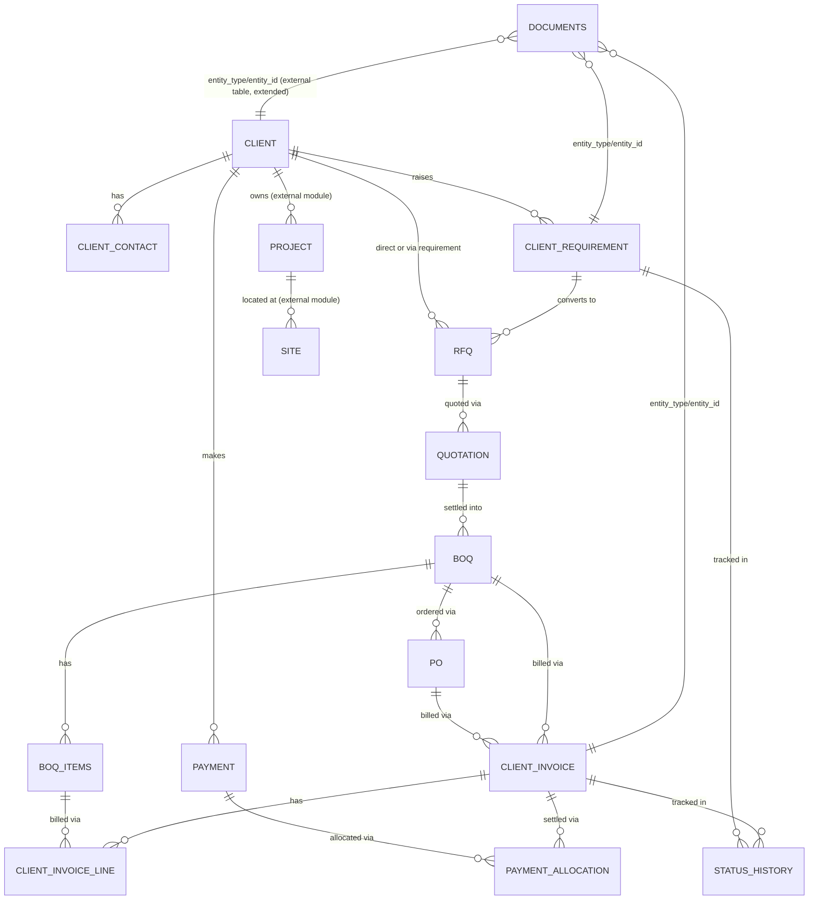
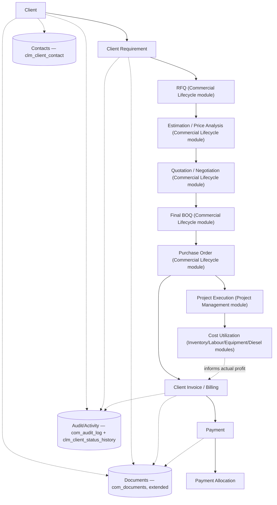

# SAV ERP — Sites → Client Management Module
### Database Architecture Specification (PostgreSQL / Supabase)

**Convention note:** This module inherits SAV ERP standing conventions — UUID v4 (`gen_random_uuid()`) primary keys, `company_id`/`branch_id` on every table, soft delete via `deleted_at` (never hard-delete), standard audit columns on all Core/Master/Transaction tables, a lighter audit set on Lookup tables, append-only History/Log tables. Table prefix for this module: `clm_` (Client Management). No AI/LLM/OCR extraction anywhere — document upload is manual, structured data entry is manual.

**⚠️ ASSUMPTIONS & ESCALATIONS — READ BEFORE HANDOFF**

1. **Module 04 overlap (unresolved, by agreement with Nethra):** SAV ERP already has a Module 04 "Client + Vendor/Subcontractor" spec containing a client master. Module 04's file was not available in this session. This document was built **standalone**, per instruction, and is flagged for a field-by-field reconciliation pass against Module 04 before implementation — same process used for the Commercial Lifecycle module. Until reconciled, treat `clm_client` in this document as the **candidate** authoritative client master, not a confirmed final decision.
2. **No duplication of Commercial Lifecycle tables.** Per explicit instruction, RFQ, Estimation, Quotation, Negotiation, BOQ, and PO are **not** redefined here. This module references the existing `com_rfq`, `com_estimation`, `com_estimation_items`, `com_quotation`, `com_quotation_items`, `com_negotiation_offers`, `com_boq`, `com_boq_items`, `com_po`, `com_po_items` tables from the Commercial Lifecycle module by FK only.
3. **FK target reconciliation needed.** The Commercial Lifecycle module's DDL references an external `clients(id)` table (e.g. `com_rfq.client_id UUID NOT NULL REFERENCES clients(id)`). This document proposes `clm_client(client_id)` as that authoritative table. **Action required:** confirm with the database team whether `clients` and `clm_client` are the same physical table (recommended: rename the FK target to `clm_client.client_id` during the unified-backend phase) or whether reconciliation with Module 04 changes this.
4. **Back-fill required on `com_rfq`.** This module introduces `clm_client_requirement` as the step before RFQ, but the existing `com_rfq` table (Commercial Lifecycle spec, §5.1) has no `requirement_id` column. **Recommendation:** add a nullable `requirement_id UUID REFERENCES clm_client_requirement(requirement_id)` to `com_rfq` in the Commercial Lifecycle file. This is documented here as a cross-module forward reference, consistent with how the Module 08 → Diesel forward reference was handled.
5. **Documents and Audit are reused, not duplicated.** This module does **not** create a new documents table or a new audit table. It extends the existing polymorphic `com_documents` and `com_audit_log` tables (Commercial Lifecycle module) with additional `entity_type` enum values. See §13/§16 for the reasoning.
6. **Cost Utilization is read-only aggregation.** Material/Labour/Equipment/Subcontract/Transport/Diesel costs are **not** owned by this module. They are assumed to live in Modules 05 (Inventory/Procurement — `stock_ledger`), 06 (Labour), 08 (Equipment), 09/11 (Diesel — `fuel_logs`/dispense ledger), and Finance (not yet specified). This document defines the **shape** of the cost-utilization view and flags each source table as external/assumed, to be corrected once those modules' final table names are confirmed.
7. **External masters assumed (not created here):** `projects`, `sites`, `users`, `employees`, `companies`, `branches`, `currencies`, `taxes`, `vendors_contractors` — plus the Commercial Lifecycle module's own tables listed in point 2 above.

---

## 1. BUSINESS WORKFLOW

```
CLIENT ONBOARDED (clm_client)
   → CLIENT CONTACT(S) recorded (clm_client_contact)
   → CLIENT REQUIREMENT received — document uploaded (com_documents) + structured entry (clm_client_requirement)
   → Requirement converted to RFQ (com_rfq, requirement_id FK — see escalation #4)
   → RFQ → Estimation → Market Price → Actual Price → Quotation → Negotiation
     (all owned by Commercial Lifecycle module — com_* tables, referenced not duplicated)
   → Final BOQ settled (com_boq, boq_type='Final')
   → Purchase Order issued (com_po, referencing com_boq)
   → PROJECT EXECUTION begins (external Project Management module, linked via com_po.project_id)
   → COST UTILIZATION accrues across Inventory/Labour/Equipment/Diesel modules,
     rolled up per project and attributed to the owning client (read-only aggregation)
   → BILLING: client invoices raised against PO/BOQ progress (clm_client_invoice)
   → PAYMENTS: client remits against invoices, allocated per invoice (clm_payment, clm_payment_allocation)
   → DOCUMENTS accumulate at every stage (com_documents, polymorphic)
   → ACTIVITY/AUDIT HISTORY captured at every stage (com_audit_log, polymorphic + clm_client_status_history)
   → CLIENT 360° PROFILE assembled entirely from views over the above (no new source-of-truth duplication)
```

---

## 2. MODULE SCOPE

**Owned by Client Management (`clm_*`):**
Client Master, Client Contacts, Client Requirements, Client Invoices (Billing), Payments, Payment Allocations, Status History, and all Client-360° read views.

**Referenced, not owned (FK only):**
- RFQ / Estimation / Quotation / Negotiation / BOQ / PO → Commercial Lifecycle module (`com_*`)
- Projects / Sites → Project Management module
- Documents → `com_documents` (extended, not duplicated)
- Audit trail → `com_audit_log` (extended, not duplicated)
- Cost data (material/labour/equipment/subcontract/transport/diesel) → Inventory, Labour, Equipment, Diesel modules
- Users/Employees/Companies/Branches/Currencies/Taxes/Vendors → existing SAV masters

This scope boundary is the direct implementation of design rule §3/§19 in the master prompt: *"clearly separate CLIENT MANAGEMENT OWNED DATA from DATA OWNED BY OTHER MODULES."*

---

## 3. ENTITIES IDENTIFIED

Client, Client Contact, Client Requirement, Client Invoice, Client Invoice Line, Payment, Payment Allocation, Client Status History — all newly owned.

Referenced-only entities (no new tables): RFQ, RFQ Item, Estimation, Estimation Item, Market Price Reference, Actual Price, Quotation, Quotation Item, Negotiation Offer, BOQ, BOQ Item, Purchase Order, PO Item, Project, Site, Document, Approval, Audit Log Entry.

---

## 4. ENTITY RESPONSIBILITY MATRIX

| Entity | Owning Module | This Module's Access |
|---|---|---|
| Client Master | **Client Management** | Full ownership |
| Client Contacts | **Client Management** | Full ownership |
| Client Requirements | **Client Management** | Full ownership |
| Client Invoices / Payments | **Client Management** | Full ownership |
| RFQ → PO chain | Commercial Lifecycle | FK reference, read-only from this module's perspective |
| Projects / Sites | Project Management | FK reference |
| Documents | Commercial Lifecycle (`com_documents`, extended) | Insert rows with `entity_type='Client'` etc. |
| Approvals | Commercial Lifecycle (`com_approvals`, extended) | Insert rows with `entity_type='ClientInvoice'` etc. |
| Audit Log | Commercial Lifecycle (`com_audit_log`, extended) | Insert rows for all `clm_*` writes |
| Cost data | Inventory/Labour/Equipment/Diesel | Read-only aggregation via view, joined by `project_id` |

---

## 5. COMPLETE TABLE LIST

| # | Table | Purpose | Category |
|---|---|---|---|
| 1 | `clm_client` | Client master | Core |
| 2 | `clm_client_contact` | Multiple contacts per client | Core |
| 3 | `clm_client_requirement` | Pre-RFQ requirement capture | Core |
| 4 | `clm_client_invoice` | Client billing header | Core |
| 5 | `clm_client_invoice_line` | Invoice line items | Core |
| 6 | `clm_payment` | Client payment transactions | Core |
| 7 | `clm_payment_allocation` | Payment ↔ Invoice allocation (many-to-many) | Supporting |
| 8 | `clm_client_status_history` | Append-only status transitions (polymorphic, client-scoped entities) | Supporting (History) |
| 9 | `clm_client_type` | Lookup: client type (Government/Private/Individual/Contractor…) | Lookup |
| 10 | `clm_industry` | Lookup: client industry | Lookup |
| — | `v_client_360_overview` | Derived VIEW | Derived |
| — | `v_client_financial_summary` | Derived VIEW | Derived |
| — | `v_client_project_summary` | Derived VIEW | Derived |
| — | `v_client_rfq_history` | Derived VIEW | Derived |
| — | `v_client_boq_summary` | Derived VIEW | Derived |
| — | `v_client_po_summary` | Derived VIEW | Derived |
| — | `v_client_cost_utilization` | Derived VIEW | Derived |
| — | `v_client_billing_summary` | Derived VIEW | Derived |
| — | `v_client_payment_summary` | Derived VIEW | Derived |
| — | `v_client_outstanding` | Derived VIEW | Derived |
| — | `v_client_profit_analysis` | Derived VIEW | Derived |
| — | `v_client_activity_history` | Derived VIEW (over `com_audit_log` + `clm_client_status_history`) | Derived |
| — | `com_rfq`, `com_quotation`, `com_boq`, `com_po`, `com_documents`, `com_audit_log`, `com_approvals`, … | External (Commercial Lifecycle module) | External Dependency |
| — | `projects`, `sites`, `users`, `employees`, `companies`, `branches`, `currencies`, `taxes` | External masters | External Dependency |

**9 owned tables + 11 views** — deliberately lean, because the transactional chain (RFQ→PO) and documents/audit are reused rather than rebuilt.

---

## 6. DETAILED TABLE-BY-TABLE SCHEMA

Legend: PK=Primary Key, FK=Foreign Key, U=Unique, IDX=Indexed. Standard audit columns (`created_at`, `created_by`, `updated_at`, `updated_by`, `deleted_at`, `deleted_by`, `company_id`, `branch_id`) are implied on every Core table and omitted below for brevity except where noted.

### 6.1 `clm_client_type` (Lookup)
| Column | Type | Null | Default | Key |
|---|---|---|---|---|
| client_type_id | UUID | N | gen_random_uuid() | PK |
| type_name | VARCHAR(100) | N | | U |
| is_active | BOOLEAN | N | true | |
*(Lighter audit: `created_at`, `created_by` only.)*

### 6.2 `clm_industry` (Lookup)
| Column | Type | Null | Default | Key |
|---|---|---|---|---|
| industry_id | UUID | N | gen_random_uuid() | PK |
| industry_name | VARCHAR(100) | N | | U |
| is_active | BOOLEAN | N | true | |

### 6.3 `clm_client` (Core — Client Master)
| Column | Type | Null | Default | Key | Description |
|---|---|---|---|---|---|
| client_id | UUID | N | gen_random_uuid() | PK | |
| client_code | VARCHAR(30) | N | | U, IDX | Business code, e.g. `CLI-0042` |
| legal_name | VARCHAR(200) | N | | IDX | Registered legal entity name |
| display_name | VARCHAR(200) | N | | IDX | Short/trade name used across UI |
| client_type_id | UUID | N | | FK→clm_client_type | |
| industry_id | UUID | | | FK→clm_industry | |
| gstin | VARCHAR(15) | | | U (partial, WHERE NOT NULL) | |
| pan | VARCHAR(10) | | | | |
| registration_number | VARCHAR(50) | | | | CIN or equivalent, nullable — not all clients are registered companies |
| billing_address_line1 | VARCHAR(255) | N | | | |
| billing_address_line2 | VARCHAR(255) | | | | |
| billing_city | VARCHAR(100) | N | | | |
| billing_state | VARCHAR(100) | N | | | |
| billing_country | VARCHAR(100) | N | 'India' | | |
| billing_pincode | VARCHAR(12) | N | | | |
| registered_address_line1 | VARCHAR(255) | | | | Nullable — same-as-billing is common; not merged into one column (rule: no multi-value columns) |
| registered_address_line2 | VARCHAR(255) | | | | |
| registered_city | VARCHAR(100) | | | | |
| registered_state | VARCHAR(100) | | | | |
| registered_country | VARCHAR(100) | | | | |
| registered_pincode | VARCHAR(12) | | | | |
| site_office_address_line1 | VARCHAR(255) | | | | |
| site_office_city | VARCHAR(100) | | | | |
| site_office_state | VARCHAR(100) | | | | |
| primary_email | VARCHAR(150) | N | | | |
| secondary_email | VARCHAR(150) | | | | |
| primary_phone | VARCHAR(20) | N | | | |
| secondary_phone | VARCHAR(20) | | | | |
| website | VARCHAR(200) | | | | |
| default_tax_id | UUID | | | FK→taxes | Default tax profile; can be overridden per invoice |
| payment_terms | TEXT | | | | Free text, e.g. "30 days from invoice" |
| credit_terms | TEXT | | | | e.g. credit limit narrative — see note below on numeric credit limit |
| credit_limit_amount | NUMERIC(18,2) | | | | Numeric credit limit, kept separate from `credit_terms` text (rule: no mixed-purpose columns) |
| client_status | clm_client_status (ENUM) | N | 'Prospect' | IDX | Prospect/Active/Inactive/Blacklisted |
| onboarding_date | DATE | | | | |
| notes | TEXT | | | | |
UNIQUE (`client_code`); partial UNIQUE (`gstin`) WHERE `gstin IS NOT NULL`

*Design note:* Billing / Registered / Site-Office addresses are three separate column groups rather than a single "address" blob or a separate `addresses` table. A dedicated `clm_client_address` table was considered (see §17, Design Review) but rejected — a client has a small, fixed, known set of address roles (3), not an open-ended list, so inline columns are simpler to query for the 360° profile without an extra join, while still respecting "no multi-value columns" (each address role has its own full column set, not concatenated).

### 6.4 `clm_client_contact` (Core)
| Column | Type | Null | Default | Key | Description |
|---|---|---|---|---|---|
| contact_id | UUID | N | gen_random_uuid() | PK | |
| client_id | UUID | N | | FK→clm_client, IDX | |
| contact_name | VARCHAR(150) | N | | | |
| designation | VARCHAR(100) | | | | |
| department | VARCHAR(100) | | | | |
| email | VARCHAR(150) | | | | |
| phone | VARCHAR(20) | | | | |
| alternate_phone | VARCHAR(20) | | | | |
| contact_type_id | UUID | N | | FK→clm_contact_type | Project Manager/Accounts/Purchase/Site Engineer/Finance/Management — see note |
| is_primary_contact | BOOLEAN | N | false | | Scoped to `contact_type_id`, not client-wide (a client can have multiple "primary" contacts, one per department — see CHECK below) |
| is_active | BOOLEAN | N | true | IDX | |
| notes | TEXT | | | | |

*Note on contact type:* `clm_contact_type` is a small additional lookup (`category_name` UNIQUE) rather than a hardcoded ENUM, since new contact roles are likely to be added operationally without a schema migration — this mirrors the `com_item_category` lookup-vs-ENUM pattern already used in Commercial Lifecycle.

Partial UNIQUE index enforces **one primary contact per (client_id, contact_type_id)**, not one primary contact per client overall — directly satisfying "a client can have multiple primary contacts for different departments."

### 6.5 `clm_contact_type` (Lookup)
| Column | Type | Null | Default | Key |
|---|---|---|---|---|
| contact_type_id | UUID | N | gen_random_uuid() | PK |
| type_name | VARCHAR(100) | N | | U |
| is_active | BOOLEAN | N | true | |

### 6.6 `clm_client_requirement` (Core)
| Column | Type | Null | Default | Key | Description |
|---|---|---|---|---|---|
| requirement_id | UUID | N | gen_random_uuid() | PK | |
| requirement_number | VARCHAR(50) | N | | U, IDX | |
| client_id | UUID | N | | FK→clm_client, IDX | |
| project_id | UUID | | | FK→projects | Nullable — project may not exist yet at requirement stage |
| requirement_title | VARCHAR(200) | N | | | |
| requirement_description | TEXT | | | | |
| received_date | DATE | N | | | |
| required_completion_date | DATE | | | | |
| priority | clm_requirement_priority (ENUM) | N | 'Medium' | | Low/Medium/High/Urgent |
| requirement_status | clm_requirement_status (ENUM) | N | 'New' | IDX | New/Under Review/Converted to RFQ/Under Estimation/Quoted/Won/Lost/Cancelled |
| assigned_employee_id | UUID | | | FK→employees | |
| notes | TEXT | | | | |

*Design note:* `source_document`/`document_id` fields from the prompt's field list are **not** columns here — they're handled by `com_documents` rows with `entity_type='Requirement'`, `entity_id=requirement_id` (polymorphic, avoids a nullable FK column per entity that would otherwise be needed on every entity that can have documents). See §13.

*Cross-reference:* `com_rfq` should carry a nullable `requirement_id UUID REFERENCES clm_client_requirement(requirement_id)` once a requirement converts to an RFQ — this is the back-fill flagged in escalation #4 at the top of this document.

### 6.7 `clm_client_invoice` (Core — Billing)
| Column | Type | Null | Default | Key | Description |
|---|---|---|---|---|---|
| invoice_id | UUID | N | gen_random_uuid() | PK | |
| invoice_number | VARCHAR(50) | N | | U, IDX | |
| client_id | UUID | N | | FK→clm_client, IDX | |
| project_id | UUID | N | | FK→projects, IDX | |
| po_id | UUID | | | FK→com_po, IDX | |
| boq_id | UUID | | | FK→com_boq | Nullable — some invoices are milestone/advance, not BOQ-item-linked |
| invoice_date | DATE | N | | | |
| billing_period_start | DATE | | | | |
| billing_period_end | DATE | | | | |
| gross_amount | NUMERIC(18,2) | N | | CHECK ≥ 0 | |
| tax_amount | NUMERIC(18,2) | N | 0 | CHECK ≥ 0 | |
| deduction_amount | NUMERIC(18,2) | N | 0 | CHECK ≥ 0 | |
| retention_amount | NUMERIC(18,2) | N | 0 | CHECK ≥ 0 | |
| net_amount | NUMERIC(18,2) | N | | GENERATED ALWAYS AS (gross_amount + tax_amount − deduction_amount − retention_amount) STORED | Same-row generated column — safe |
| due_date | DATE | | | | |
| status | clm_invoice_status (ENUM) | N | 'Draft' | IDX | Draft/Submitted/Approved/Partially Paid/Paid/Overdue/Cancelled |
| remarks | TEXT | | | | |

*Design note — no stored `paid_amount`/`balance_amount` columns:* per prompt's own instruction ("do not manually maintain derived outstanding amounts if they can safely be calculated"), paid amount and balance are **computed**, not stored — see `v_client_billing_summary` (§11) which sums `clm_payment_allocation.allocated_amount` per invoice and derives `balance = net_amount − paid_amount`. `status = 'Overdue'` is set by a scheduled job comparing `due_date` against current date where balance > 0 — flagged as an application/job concern, not a DB trigger, to avoid write-on-read side effects.

### 6.8 `clm_client_invoice_line` (Core)
| Column | Type | Null | Default | Key | Description |
|---|---|---|---|---|---|
| invoice_line_id | UUID | N | gen_random_uuid() | PK | |
| invoice_id | UUID | N | | FK→clm_client_invoice, IDX | |
| boq_item_id | UUID | | | FK→com_boq_items | Traceability — nullable, some lines are milestone/lump-sum |
| description | TEXT | N | | | |
| unit | VARCHAR(20) | | | | |
| quantity | NUMERIC(18,3) | | | CHECK (quantity IS NULL OR quantity > 0) | Nullable for lump-sum lines |
| rate | NUMERIC(18,4) | | | CHECK (rate IS NULL OR rate >= 0) | |
| line_amount | NUMERIC(18,2) | N | | CHECK ≥ 0 | Stored directly (not generated) — lump-sum lines have no qty×rate to derive from |
| sequence_no | INTEGER | N | | | |
| remarks | TEXT | | | | |

### 6.9 `clm_payment` (Core)
| Column | Type | Null | Default | Key | Description |
|---|---|---|---|---|---|
| payment_id | UUID | N | gen_random_uuid() | PK | |
| payment_reference_number | VARCHAR(100) | N | | U, IDX | Bank/UTR/cheque reference |
| client_id | UUID | N | | FK→clm_client, IDX | |
| project_id | UUID | | | FK→projects | Nullable — a payment may cover multiple projects, resolved via allocation |
| payment_date | DATE | N | | IDX | |
| amount | NUMERIC(18,2) | N | | CHECK > 0 | Total received amount |
| payment_method | clm_payment_method (ENUM) | N | | | Bank Transfer/Cheque/DD/UPI/Other |
| bank_reference_details | VARCHAR(200) | | | | |
| verification_status | clm_verification_status (ENUM) | N | 'Pending' | IDX | Pending/Verified/Rejected |
| verified_by | UUID | | | FK→users | |
| remarks | TEXT | | | | |

*Design note:* No `invoice_id` column on this table — a single payment routinely covers multiple invoices, or an invoice is settled by multiple payments (many-to-many), so allocation is handled entirely through `clm_payment_allocation` rather than forcing a 1:1 shortcut here.

### 6.10 `clm_payment_allocation` (Supporting — junction)
| Column | Type | Null | Default | Key | Description |
|---|---|---|---|---|---|
| allocation_id | UUID | N | gen_random_uuid() | PK | |
| payment_id | UUID | N | | FK→clm_payment, IDX | |
| invoice_id | UUID | N | | FK→clm_client_invoice, IDX | |
| allocated_amount | NUMERIC(18,2) | N | | CHECK > 0 | |
| allocated_date | DATE | N | | | |
| remarks | TEXT | | | | |
UNIQUE (`payment_id`, `invoice_id`)
*(Lighter audit: `created_at`, `created_by` only — allocations are corrected by a reversing new row per accounting practice, not by update, consistent with the ledger-pattern principle already locked for the ERP.)*

*Business rule (app-layer, mirrored as a CHECK-adjacent constraint via trigger — see §9):* `SUM(allocated_amount) FOR a given payment_id` must not exceed `clm_payment.amount`; `SUM(allocated_amount) FOR a given invoice_id` must not exceed `clm_client_invoice.net_amount`. Enforced via `AFTER INSERT` trigger raising an exception rather than a CHECK (CHECK constraints cannot aggregate across rows).

### 6.11 `clm_client_status_history` (Supporting — append-only, polymorphic)
| Column | Type | Null | Default | Key | Description |
|---|---|---|---|---|---|
| status_history_id | UUID | N | gen_random_uuid() | PK | |
| entity_type | clm_status_entity_type (ENUM) | N | | IDX | ClientRequirement/ClientInvoice (RFQ/Project/PO/BOQ status history stays owned by their respective modules) |
| entity_id | UUID | N | | IDX | Composite IDX (entity_type, entity_id) |
| old_status | VARCHAR(50) | | | | |
| new_status | VARCHAR(50) | N | | | |
| changed_by | UUID | N | | FK→users | |
| changed_at | TIMESTAMPTZ | N | now() | IDX | |
| remarks | TEXT | | | | |
*(No update/delete columns — immutable by design, same pattern as `com_actual_price_history`/`com_negotiation_offers`.)*

*Design note:* Status history for RFQ/BOQ/PO/Invoice-adjacent entities that belong to *other* modules is **not** duplicated here. This table only tracks status transitions for entities this module owns (`ClientRequirement`, `ClientInvoice`). RFQ/BOQ/PO status transitions should be tracked by an equivalent table inside the Commercial Lifecycle module if not already covered by its `status` ENUM + `com_audit_log` — flagged as a cross-module note rather than solved here, to avoid this module reaching into another module's transactional history.

---

## 7. RELATIONSHIPS

- **Client → Contacts** (1:many): `clm_client_contact.client_id → clm_client.client_id`. A client's full contact list is queried directly; no join table needed since contacts belong to exactly one client.
- **Client → Requirements** (1:many): `clm_client_requirement.client_id → clm_client.client_id`.
- **Requirement → RFQ** (1:1 typical, modeled as 1:many for flexibility): via the back-filled `com_rfq.requirement_id` (escalation #4). A requirement *can* spawn more than one RFQ (e.g. requirement is split), so this is intentionally not a UNIQUE FK.
- **Client → RFQ** (1:many, direct): `com_rfq.client_id → clm_client.client_id` (subject to FK-target reconciliation, escalation #3). This direct link exists *in addition to* the Requirement path because not every RFQ originates from a logged Requirement (e.g. verbal/urgent RFQs).
- **Client → Projects** (1:many): via the external Project Management module — `projects.client_id` is assumed to already exist there (not created by this module). Client Management **reads** `projects` by FK; it does not own the projects table. Project → Site: `projects.site_id → sites.site_id`, both external.
- **Project → BOQ / PO**: via `com_boq.project_id`, `com_po.project_id` (both already present in the Commercial Lifecycle schema).
- **PO → Invoice**: `clm_client_invoice.po_id → com_po.po_id` (nullable — advance/mobilization invoices may precede a PO).
- **BOQ Item → Invoice Line**: `clm_client_invoice_line.boq_item_id → com_boq_items.boq_item_id` (nullable — lump-sum lines).
- **Invoice → Payment**: many-to-many via `clm_payment_allocation`, not a direct FK — this is the one relationship in this spec that is *not* a simple 1:many, because the business explicitly requires "one invoice → multiple payments" **and** implicitly allows one payment to cover multiple invoices (a single bank transfer settling several outstanding bills is standard construction-billing practice).
- **Documents**: polymorphic against the *existing* `com_documents` table — `(entity_type, entity_id)` where `entity_type` gains new values `Client`, `ClientContact`, `ClientRequirement`, `ClientInvoice`, `ClientPayment`.
- **Approvals**: same pattern against `com_approvals`, new `entity_type` values `ClientInvoice` (approval-before-submission workflow) if the business requires an approval gate on invoices — optional, included in the ENUM for completeness.
- **Audit**: every `clm_*` write should also insert into `com_audit_log` with `entity_type` set to the relevant `clm_*` table name — no separate audit table is created for this module.

No circular dependencies: the FK graph flows strictly Client → Requirement → RFQ(external) → …→ PO(external) → Invoice → Payment, one direction, matching the business workflow. Self-referencing FKs are not needed anywhere in this module (unlike RFQ Items/BOQ Items, which are hierarchical and live in the Commercial Lifecycle module).

---

## 8. COMPLETE MERMAID ERD



*(RFQ, QUOTATION, BOQ, BOQ_ITEMS, PO nodes above represent the existing `com_*` tables from the Commercial Lifecycle module, shown here only to illustrate the connection points — full detail is in that module's own ERD.)*

---

## 9. SQL DDL

```sql
-- ============================================================
-- SAV ERP — Client Management Module
-- External dependencies (NOT created here):
--   companies, branches, users, employees, projects, sites,
--   currencies, taxes,
--   com_rfq, com_quotation, com_boq, com_boq_items, com_po,
--   com_documents, com_approvals, com_audit_log  (Commercial Lifecycle module)
-- ============================================================

-- ---------- ENUM TYPES ----------
CREATE TYPE clm_client_status AS ENUM ('Prospect','Active','Inactive','Blacklisted');

CREATE TYPE clm_requirement_priority AS ENUM ('Low','Medium','High','Urgent');

CREATE TYPE clm_requirement_status AS ENUM
  ('New','Under Review','Converted to RFQ','Under Estimation','Quoted','Won','Lost','Cancelled');

CREATE TYPE clm_invoice_status AS ENUM
  ('Draft','Submitted','Approved','Partially Paid','Paid','Overdue','Cancelled');

CREATE TYPE clm_payment_method AS ENUM ('Bank Transfer','Cheque','DD','UPI','Other');

CREATE TYPE clm_verification_status AS ENUM ('Pending','Verified','Rejected');

CREATE TYPE clm_status_entity_type AS ENUM ('ClientRequirement','ClientInvoice');

-- ---------- LOOKUP TABLES ----------
CREATE TABLE clm_client_type (
  client_type_id UUID PRIMARY KEY DEFAULT gen_random_uuid(),
  type_name      VARCHAR(100) NOT NULL UNIQUE,
  is_active      BOOLEAN NOT NULL DEFAULT true,
  created_at     TIMESTAMPTZ NOT NULL DEFAULT now(),
  created_by     UUID NOT NULL REFERENCES users(id)
);

CREATE TABLE clm_industry (
  industry_id   UUID PRIMARY KEY DEFAULT gen_random_uuid(),
  industry_name VARCHAR(100) NOT NULL UNIQUE,
  is_active     BOOLEAN NOT NULL DEFAULT true,
  created_at    TIMESTAMPTZ NOT NULL DEFAULT now(),
  created_by    UUID NOT NULL REFERENCES users(id)
);

CREATE TABLE clm_contact_type (
  contact_type_id UUID PRIMARY KEY DEFAULT gen_random_uuid(),
  type_name       VARCHAR(100) NOT NULL UNIQUE,
  is_active       BOOLEAN NOT NULL DEFAULT true,
  created_at      TIMESTAMPTZ NOT NULL DEFAULT now(),
  created_by      UUID NOT NULL REFERENCES users(id)
);

-- ---------- CLIENT MASTER ----------
CREATE TABLE clm_client (
  client_id                UUID PRIMARY KEY DEFAULT gen_random_uuid(),
  client_code               VARCHAR(30) NOT NULL UNIQUE,
  legal_name                 VARCHAR(200) NOT NULL,
  display_name                VARCHAR(200) NOT NULL,
  client_type_id                UUID NOT NULL REFERENCES clm_client_type(client_type_id),
  industry_id                    UUID REFERENCES clm_industry(industry_id),
  gstin                            VARCHAR(15),
  pan                                VARCHAR(10),
  registration_number                 VARCHAR(50),
  billing_address_line1                 VARCHAR(255) NOT NULL,
  billing_address_line2                   VARCHAR(255),
  billing_city                              VARCHAR(100) NOT NULL,
  billing_state                               VARCHAR(100) NOT NULL,
  billing_country                               VARCHAR(100) NOT NULL DEFAULT 'India',
  billing_pincode                                 VARCHAR(12) NOT NULL,
  registered_address_line1                          VARCHAR(255),
  registered_address_line2                            VARCHAR(255),
  registered_city                                       VARCHAR(100),
  registered_state                                        VARCHAR(100),
  registered_country                                        VARCHAR(100),
  registered_pincode                                          VARCHAR(12),
  site_office_address_line1                                     VARCHAR(255),
  site_office_city                                                 VARCHAR(100),
  site_office_state                                                  VARCHAR(100),
  primary_email                                                        VARCHAR(150) NOT NULL,
  secondary_email                                                        VARCHAR(150),
  primary_phone                                                            VARCHAR(20) NOT NULL,
  secondary_phone                                                            VARCHAR(20),
  website                                                                      VARCHAR(200),
  default_tax_id                                                                 UUID REFERENCES taxes(id),
  payment_terms                                                                    TEXT,
  credit_terms                                                                       TEXT,
  credit_limit_amount                                                                  NUMERIC(18,2) CHECK (credit_limit_amount IS NULL OR credit_limit_amount >= 0),
  client_status                                                                          clm_client_status NOT NULL DEFAULT 'Prospect',
  onboarding_date                                                                          DATE,
  notes                                                                                      TEXT,
  company_id                                                                                   UUID NOT NULL REFERENCES companies(id),
  branch_id                                                                                      UUID REFERENCES branches(id),
  created_at                                                                                       TIMESTAMPTZ NOT NULL DEFAULT now(),
  created_by                                                                                         UUID NOT NULL REFERENCES users(id),
  updated_at                                                                                           TIMESTAMPTZ NOT NULL DEFAULT now(),
  updated_by                                                                                             UUID REFERENCES users(id),
  deleted_at                                                                                               TIMESTAMPTZ,
  deleted_by                                                                                                 UUID REFERENCES users(id)
);
CREATE UNIQUE INDEX uq_clm_client_gstin ON clm_client(gstin) WHERE gstin IS NOT NULL;
CREATE INDEX idx_clm_client_status ON clm_client(client_status);
CREATE INDEX idx_clm_client_legalname ON clm_client(legal_name);
CREATE INDEX idx_clm_client_displayname ON clm_client(display_name);

-- ---------- CLIENT CONTACTS ----------
CREATE TABLE clm_client_contact (
  contact_id          UUID PRIMARY KEY DEFAULT gen_random_uuid(),
  client_id             UUID NOT NULL REFERENCES clm_client(client_id) ON DELETE RESTRICT,
  contact_name            VARCHAR(150) NOT NULL,
  designation                VARCHAR(100),
  department                   VARCHAR(100),
  email                          VARCHAR(150),
  phone                            VARCHAR(20),
  alternate_phone                    VARCHAR(20),
  contact_type_id                      UUID NOT NULL REFERENCES clm_contact_type(contact_type_id),
  is_primary_contact                     BOOLEAN NOT NULL DEFAULT false,
  is_active                                BOOLEAN NOT NULL DEFAULT true,
  notes                                      TEXT,
  company_id                                   UUID NOT NULL REFERENCES companies(id),
  branch_id                                      UUID REFERENCES branches(id),
  created_at                                       TIMESTAMPTZ NOT NULL DEFAULT now(),
  created_by                                         UUID NOT NULL REFERENCES users(id),
  updated_at                                           TIMESTAMPTZ NOT NULL DEFAULT now(),
  updated_by                                             UUID REFERENCES users(id),
  deleted_at                                               TIMESTAMPTZ,
  deleted_by                                                 UUID REFERENCES users(id)
);
CREATE INDEX idx_clm_contact_client ON clm_client_contact(client_id);
CREATE UNIQUE INDEX uq_clm_contact_primary_per_type
  ON clm_client_contact(client_id, contact_type_id)
  WHERE is_primary_contact = true AND deleted_at IS NULL;

-- ---------- CLIENT REQUIREMENTS ----------
CREATE TABLE clm_client_requirement (
  requirement_id             UUID PRIMARY KEY DEFAULT gen_random_uuid(),
  requirement_number           VARCHAR(50) NOT NULL UNIQUE,
  client_id                       UUID NOT NULL REFERENCES clm_client(client_id) ON DELETE RESTRICT,
  project_id                         UUID REFERENCES projects(id),
  requirement_title                     VARCHAR(200) NOT NULL,
  requirement_description                  TEXT,
  received_date                              DATE NOT NULL,
  required_completion_date                     DATE,
  priority                                       clm_requirement_priority NOT NULL DEFAULT 'Medium',
  requirement_status                               clm_requirement_status NOT NULL DEFAULT 'New',
  assigned_employee_id                               UUID REFERENCES employees(id),
  notes                                                TEXT,
  company_id                                             UUID NOT NULL REFERENCES companies(id),
  branch_id                                                UUID REFERENCES branches(id),
  created_at                                                 TIMESTAMPTZ NOT NULL DEFAULT now(),
  created_by                                                   UUID NOT NULL REFERENCES users(id),
  updated_at                                                     TIMESTAMPTZ NOT NULL DEFAULT now(),
  updated_by                                                       UUID REFERENCES users(id),
  deleted_at                                                         TIMESTAMPTZ,
  deleted_by                                                           UUID REFERENCES users(id)
);
CREATE INDEX idx_clm_requirement_client ON clm_client_requirement(client_id);
CREATE INDEX idx_clm_requirement_status ON clm_client_requirement(requirement_status);

-- ---------- CLIENT INVOICE (BILLING) ----------
CREATE TABLE clm_client_invoice (
  invoice_id             UUID PRIMARY KEY DEFAULT gen_random_uuid(),
  invoice_number            VARCHAR(50) NOT NULL UNIQUE,
  client_id                    UUID NOT NULL REFERENCES clm_client(client_id) ON DELETE RESTRICT,
  project_id                      UUID NOT NULL REFERENCES projects(id),
  po_id                              UUID REFERENCES com_po(po_id),
  boq_id                                UUID REFERENCES com_boq(boq_id),
  invoice_date                            DATE NOT NULL,
  billing_period_start                       DATE,
  billing_period_end                            DATE,
  gross_amount                                     NUMERIC(18,2) NOT NULL CHECK (gross_amount >= 0),
  tax_amount                                          NUMERIC(18,2) NOT NULL DEFAULT 0 CHECK (tax_amount >= 0),
  deduction_amount                                       NUMERIC(18,2) NOT NULL DEFAULT 0 CHECK (deduction_amount >= 0),
  retention_amount                                          NUMERIC(18,2) NOT NULL DEFAULT 0 CHECK (retention_amount >= 0),
  net_amount                                                   NUMERIC(18,2) GENERATED ALWAYS AS
    (gross_amount + tax_amount - deduction_amount - retention_amount) STORED,
  due_date                                                        DATE,
  status                                                             clm_invoice_status NOT NULL DEFAULT 'Draft',
  remarks                                                               TEXT,
  company_id                                                              UUID NOT NULL REFERENCES companies(id),
  branch_id                                                                 UUID REFERENCES branches(id),
  created_at                                                                  TIMESTAMPTZ NOT NULL DEFAULT now(),
  created_by                                                                    UUID NOT NULL REFERENCES users(id),
  updated_at                                                                      TIMESTAMPTZ NOT NULL DEFAULT now(),
  updated_by                                                                        UUID REFERENCES users(id),
  deleted_at                                                                          TIMESTAMPTZ,
  deleted_by                                                                            UUID REFERENCES users(id)
);
CREATE INDEX idx_clm_invoice_client ON clm_client_invoice(client_id);
CREATE INDEX idx_clm_invoice_project ON clm_client_invoice(project_id);
CREATE INDEX idx_clm_invoice_po ON clm_client_invoice(po_id);
CREATE INDEX idx_clm_invoice_status ON clm_client_invoice(status);
CREATE INDEX idx_clm_invoice_duedate ON clm_client_invoice(due_date);

-- ---------- CLIENT INVOICE LINES ----------
CREATE TABLE clm_client_invoice_line (
  invoice_line_id      UUID PRIMARY KEY DEFAULT gen_random_uuid(),
  invoice_id             UUID NOT NULL REFERENCES clm_client_invoice(invoice_id) ON DELETE RESTRICT,
  boq_item_id               UUID REFERENCES com_boq_items(boq_item_id),
  description                  TEXT NOT NULL,
  unit                            VARCHAR(20),
  quantity                          NUMERIC(18,3) CHECK (quantity IS NULL OR quantity > 0),
  rate                                 NUMERIC(18,4) CHECK (rate IS NULL OR rate >= 0),
  line_amount                             NUMERIC(18,2) NOT NULL CHECK (line_amount >= 0),
  sequence_no                                INTEGER NOT NULL,
  remarks                                       TEXT,
  company_id                                       UUID NOT NULL REFERENCES companies(id),
  branch_id                                          UUID REFERENCES branches(id),
  created_at                                            TIMESTAMPTZ NOT NULL DEFAULT now(),
  created_by                                              UUID NOT NULL REFERENCES users(id),
  updated_at                                                TIMESTAMPTZ NOT NULL DEFAULT now(),
  updated_by                                                  UUID REFERENCES users(id),
  deleted_at                                                    TIMESTAMPTZ,
  deleted_by                                                      UUID REFERENCES users(id)
);
CREATE INDEX idx_clm_invline_invoice ON clm_client_invoice_line(invoice_id);
CREATE INDEX idx_clm_invline_boqitem ON clm_client_invoice_line(boq_item_id);

-- ---------- PAYMENT ----------
CREATE TABLE clm_payment (
  payment_id                UUID PRIMARY KEY DEFAULT gen_random_uuid(),
  payment_reference_number    VARCHAR(100) NOT NULL UNIQUE,
  client_id                      UUID NOT NULL REFERENCES clm_client(client_id) ON DELETE RESTRICT,
  project_id                        UUID REFERENCES projects(id),
  payment_date                         DATE NOT NULL,
  amount                                   NUMERIC(18,2) NOT NULL CHECK (amount > 0),
  payment_method                              clm_payment_method NOT NULL,
  bank_reference_details                         VARCHAR(200),
  verification_status                               clm_verification_status NOT NULL DEFAULT 'Pending',
  verified_by                                          UUID REFERENCES users(id),
  remarks                                                 TEXT,
  company_id                                                 UUID NOT NULL REFERENCES companies(id),
  branch_id                                                     UUID REFERENCES branches(id),
  created_at                                                       TIMESTAMPTZ NOT NULL DEFAULT now(),
  created_by                                                          UUID NOT NULL REFERENCES users(id),
  updated_at                                                             TIMESTAMPTZ NOT NULL DEFAULT now(),
  updated_by                                                                UUID REFERENCES users(id),
  deleted_at                                                                   TIMESTAMPTZ,
  deleted_by                                                                      UUID REFERENCES users(id)
);
CREATE INDEX idx_clm_payment_client ON clm_payment(client_id);
CREATE INDEX idx_clm_payment_date ON clm_payment(payment_date);
CREATE INDEX idx_clm_payment_verification ON clm_payment(verification_status);

-- ---------- PAYMENT ALLOCATION ----------
CREATE TABLE clm_payment_allocation (
  allocation_id      UUID PRIMARY KEY DEFAULT gen_random_uuid(),
  payment_id            UUID NOT NULL REFERENCES clm_payment(payment_id) ON DELETE RESTRICT,
  invoice_id               UUID NOT NULL REFERENCES clm_client_invoice(invoice_id) ON DELETE RESTRICT,
  allocated_amount            NUMERIC(18,2) NOT NULL CHECK (allocated_amount > 0),
  allocated_date                  DATE NOT NULL,
  remarks                            TEXT,
  company_id                            UUID NOT NULL REFERENCES companies(id),
  branch_id                                UUID REFERENCES branches(id),
  created_at                                  TIMESTAMPTZ NOT NULL DEFAULT now(),
  created_by                                     UUID NOT NULL REFERENCES users(id),
  UNIQUE (payment_id, invoice_id)
);
CREATE INDEX idx_clm_alloc_payment ON clm_payment_allocation(payment_id);
CREATE INDEX idx_clm_alloc_invoice ON clm_payment_allocation(invoice_id);

-- Guard: allocations cannot exceed the payment amount or the invoice net amount
CREATE OR REPLACE FUNCTION clm_fn_check_allocation() RETURNS TRIGGER
LANGUAGE plpgsql AS $$
DECLARE
  v_payment_total NUMERIC(18,2);
  v_payment_amount NUMERIC(18,2);
  v_invoice_total NUMERIC(18,2);
  v_invoice_net NUMERIC(18,2);
BEGIN
  SELECT COALESCE(SUM(allocated_amount),0) INTO v_payment_total
    FROM clm_payment_allocation WHERE payment_id = NEW.payment_id;
  SELECT amount INTO v_payment_amount FROM clm_payment WHERE payment_id = NEW.payment_id;
  IF v_payment_total > v_payment_amount THEN
    RAISE EXCEPTION 'Allocated amount exceeds payment amount for payment_id %', NEW.payment_id;
  END IF;

  SELECT COALESCE(SUM(allocated_amount),0) INTO v_invoice_total
    FROM clm_payment_allocation WHERE invoice_id = NEW.invoice_id;
  SELECT net_amount INTO v_invoice_net FROM clm_client_invoice WHERE invoice_id = NEW.invoice_id;
  IF v_invoice_total > v_invoice_net THEN
    RAISE EXCEPTION 'Allocated amount exceeds invoice net amount for invoice_id %', NEW.invoice_id;
  END IF;
  RETURN NEW;
END; $$;

CREATE TRIGGER trg_clm_check_allocation
AFTER INSERT ON clm_payment_allocation
FOR EACH ROW EXECUTE FUNCTION clm_fn_check_allocation();

-- ---------- STATUS HISTORY (append-only, polymorphic) ----------
CREATE TABLE clm_client_status_history (
  status_history_id  UUID PRIMARY KEY DEFAULT gen_random_uuid(),
  entity_type            clm_status_entity_type NOT NULL,
  entity_id                  UUID NOT NULL,
  old_status                    VARCHAR(50),
  new_status                       VARCHAR(50) NOT NULL,
  changed_by                          UUID NOT NULL REFERENCES users(id),
  changed_at                             TIMESTAMPTZ NOT NULL DEFAULT now(),
  remarks                                   TEXT
);
CREATE INDEX idx_clm_statushist_entity ON clm_client_status_history(entity_type, entity_id);
CREATE INDEX idx_clm_statushist_time ON clm_client_status_history(changed_at);

-- ---------- EXTEND EXISTING POLYMORPHIC ENUMS (Commercial Lifecycle module) ----------
-- Run against the Commercial Lifecycle module's schema, not created fresh here:
-- ALTER TYPE com_document_entity_type ADD VALUE IF NOT EXISTS 'Client';
-- ALTER TYPE com_document_entity_type ADD VALUE IF NOT EXISTS 'ClientContact';
-- ALTER TYPE com_document_entity_type ADD VALUE IF NOT EXISTS 'ClientRequirement';
-- ALTER TYPE com_document_entity_type ADD VALUE IF NOT EXISTS 'ClientInvoice';
-- ALTER TYPE com_document_entity_type ADD VALUE IF NOT EXISTS 'ClientPayment';
-- ALTER TYPE com_approval_entity_type ADD VALUE IF NOT EXISTS 'ClientInvoice';
```

---

## 10. SAMPLE DATA

**Client:** Jindal Industries (`client_code = CLI-0042`)
**Project:** JSW Foundation
**Site:** TN1
**RFQ:** `RFQ-001`

| Field | Value |
|---|---|
| Requirement | `REQ-2026-0011` — "Foundation works for JSW plant expansion", status `Converted to RFQ` |
| RFQ | `RFQ-001`, `requirement_id → REQ-2026-0011`, `client_id → Jindal Industries` |
| Estimated Cost (RFQ total, from `v_item_commercial_analysis` in Commercial Lifecycle module) | ₹2.70 Cr |
| Our Quotation | ₹3.20 Cr |
| Client Offer | ₹2.85 Cr |
| Final Agreed Price (`com_negotiation_offers.is_final = true`) | ₹3.00 Cr |
| Final BOQ | `boq_type = 'Final'`, `total_value ≈ ₹3.00 Cr` |
| PO | `PO-2026-0077`, `po_value = ₹3.00 Cr`, `boq_id → Final BOQ` |
| Invoice 1 | `INV-2026-0201`, `gross_amount = ₹75,00,000` (25% milestone), `net_amount = ₹73,50,000` after retention |
| Payment 1 | `PAY-2026-0301`, `amount = ₹73,50,000`, allocated 100% to `INV-2026-0201` |

**Connection chain:**
```
clm_client(Jindal Industries)
 → clm_client_requirement(REQ-2026-0011)
   → com_rfq(RFQ-001, requirement_id=REQ-2026-0011, client_id=Jindal Industries)
     → com_quotation(v1, ₹3.20 Cr) → com_negotiation_offers(...,is_final,₹3.00 Cr)
       → com_boq(Final, ₹3.00 Cr)
         → com_po(PO-2026-0077, ₹3.00 Cr)
           → clm_client_invoice(INV-2026-0201, project_id=JSW Foundation)
             → clm_payment(PAY-2026-0301) → clm_payment_allocation(₹73,50,000 → INV-2026-0201)
```

---

## 11. CLIENT 360° QUERY DESIGN

```sql
-- Client overview
CREATE VIEW v_client_360_overview AS
SELECT c.client_id, c.client_code, c.legal_name, c.display_name, c.client_status,
       ct.type_name AS client_type, i.industry_name
FROM clm_client c
LEFT JOIN clm_client_type ct ON ct.client_type_id = c.client_type_id
LEFT JOIN clm_industry i ON i.industry_id = c.industry_id
WHERE c.deleted_at IS NULL;

-- Project summary per client
CREATE VIEW v_client_project_summary AS
SELECT p.client_id, p.id AS project_id, p.project_name, p.status AS project_status,
       p.contract_value
FROM projects p; -- external table, columns assumed per Module 02 spec

-- RFQ history per client
CREATE VIEW v_client_rfq_history AS
SELECT r.client_id, r.rfq_id, r.rfq_number, r.rfq_date, r.status,
       vca.estimated_total_cost, qi.quoted_rate, no_final.offered_rate AS final_agreed_rate
FROM com_rfq r
LEFT JOIN v_item_commercial_analysis vca ON vca.rfq_item_id IN (
  SELECT rfq_item_id FROM com_rfq_items WHERE rfq_id = r.rfq_id)
LEFT JOIN com_quotation_items qi ON qi.rfq_item_id = vca.rfq_item_id
LEFT JOIN com_negotiation_offers no_final
  ON no_final.quotation_item_id = qi.quotation_item_id AND no_final.is_final = true;

-- BOQ summary per client
CREATE VIEW v_client_boq_summary AS
SELECT b.client_id, b.boq_id, b.boq_number, b.version_no, b.boq_type, b.status
FROM com_boq b;

-- PO summary per client, with remaining value
CREATE VIEW v_client_po_summary AS
SELECT po.po_id, po.po_number, po.total_amount AS po_value,
       COALESCE(SUM(inv.net_amount), 0) AS amount_billed,
       po.total_amount - COALESCE(SUM(inv.net_amount), 0) AS remaining_po_value
FROM com_po po
LEFT JOIN clm_client_invoice inv ON inv.po_id = po.po_id AND inv.deleted_at IS NULL
GROUP BY po.po_id, po.po_number, po.total_amount;

-- Billing summary (outstanding computed, never stored)
CREATE VIEW v_client_billing_summary AS
SELECT inv.invoice_id, inv.invoice_number, inv.client_id, inv.net_amount,
       COALESCE(SUM(pa.allocated_amount), 0) AS paid_amount,
       inv.net_amount - COALESCE(SUM(pa.allocated_amount), 0) AS balance_amount,
       inv.status
FROM clm_client_invoice inv
LEFT JOIN clm_payment_allocation pa ON pa.invoice_id = inv.invoice_id
WHERE inv.deleted_at IS NULL
GROUP BY inv.invoice_id, inv.invoice_number, inv.client_id, inv.net_amount, inv.status;

-- Payment summary per client
CREATE VIEW v_client_payment_summary AS
SELECT p.client_id, p.payment_id, p.payment_reference_number, p.amount, p.payment_date,
       COALESCE(SUM(pa.allocated_amount), 0) AS allocated_total,
       p.amount - COALESCE(SUM(pa.allocated_amount), 0) AS unallocated_amount
FROM clm_payment p
LEFT JOIN clm_payment_allocation pa ON pa.payment_id = p.payment_id
GROUP BY p.client_id, p.payment_id, p.payment_reference_number, p.amount, p.payment_date;

-- Outstanding amount per client (single number for the 360 header)
CREATE VIEW v_client_outstanding AS
SELECT client_id, SUM(balance_amount) AS total_outstanding
FROM v_client_billing_summary
GROUP BY client_id;

-- Financial summary (top of Client 360)
CREATE VIEW v_client_financial_summary AS
SELECT c.client_id,
       COALESCE(SUM(DISTINCT po.total_amount), 0) AS total_po_value,
       COALESCE(SUM(inv.net_amount), 0) AS total_billed,
       COALESCE(SUM(pa.allocated_amount), 0) AS total_received,
       COALESCE(SUM(inv.net_amount), 0) - COALESCE(SUM(pa.allocated_amount), 0) AS outstanding
FROM clm_client c
LEFT JOIN com_po po ON po.client_id = c.client_id  -- see escalation #3 on FK target
LEFT JOIN clm_client_invoice inv ON inv.client_id = c.client_id AND inv.deleted_at IS NULL
LEFT JOIN clm_payment_allocation pa ON pa.invoice_id = inv.invoice_id
GROUP BY c.client_id;

-- Documents per client (and per any client-owned entity)
CREATE VIEW v_client_documents AS
SELECT d.* FROM com_documents d
WHERE d.entity_type IN ('Client','ClientContact','ClientRequirement','ClientInvoice','ClientPayment');

-- Activity/audit history (unioned, chronological)
CREATE VIEW v_client_activity_history AS
SELECT 'audit' AS source, entity_type::text, entity_id, action::text AS event, performed_at AS event_time
FROM com_audit_log
WHERE entity_type LIKE 'clm_%' OR entity_type LIKE 'com_rfq%' OR entity_type LIKE 'com_quotation%'
UNION ALL
SELECT 'status_change', entity_type::text, entity_id,
       old_status || ' → ' || new_status, changed_at
FROM clm_client_status_history;
```

*(`v_client_cost_utilization` and `v_client_profit_analysis` are defined in §12/§13 below, since they depend on the financial-calculation formulas discussed there.)*

---

## 12. FINANCIAL CALCULATIONS

| Metric | Formula | Storage |
|---|---|---|
| Difference (rate) | `quoted_rate − actual_rate` | Calculated (view — already in Commercial Lifecycle `v_item_commercial_analysis`) |
| Difference % | `(difference / actual_rate) × 100`, NULLIF-guarded | Calculated (view) |
| Profit | `quoted_value − estimated_total_cost` (or `final_agreed_value − estimated_total_cost` for the settled variant) | Calculated (view) |
| Profit % | `profit / quoted_value × 100`, NULLIF-guarded | Calculated (view) |
| PO Remaining | `po.total_amount − SUM(invoice.net_amount WHERE po_id = po.id)` | Calculated (view — `v_client_po_summary`) |
| Invoice Outstanding | `invoice.net_amount − SUM(payment_allocation.allocated_amount)` | Calculated (view — `v_client_billing_summary`); **never** stored on the invoice row |
| Total Received | `SUM(payment_allocation.allocated_amount)` per client | Calculated (view) |
| Total Cost (utilized) | `SUM` across Inventory `stock_ledger`, Labour cost, Equipment usage cost, Diesel `fuel_logs`, filtered by `project_id`, rolled up to client via `projects.client_id` | Calculated (view, cross-module — see §13) |
| Estimated Profit | `contract_value (PO total) − estimated_total_cost (from Commercial Lifecycle)` | Calculated (view) |
| Actual Profit | `total_billed − total_cost_utilized` | Calculated (view) |

**Everything in this table is a view, never a stored/duplicated column** — consistent with both this module's own rules and the Commercial Lifecycle module's existing precedent (`v_item_commercial_analysis`). The only generated *(same-row)* columns in this module are `clm_client_invoice.net_amount` (gross+tax−deductions−retention, all columns on the same row — safe per the existing generated-column rule) and `clm_boq_items`-style `amount` columns that already live in the Commercial Lifecycle module.

---

## 13. RECOMMENDED DATABASE VIEWS

Beyond the views already listed in §11, two cross-module views complete the 360° profile:

```sql
-- Cost utilization (cross-module aggregation, READ-ONLY — flagged: source table
-- names are ASSUMED pending confirmation from Inventory/Labour/Equipment/Diesel specs)
CREATE VIEW v_client_cost_utilization AS
SELECT proj.client_id,
       proj.id AS project_id,
       COALESCE(mat.material_cost, 0)     AS material_cost,
       COALESCE(lab.labour_cost, 0)       AS labour_cost,
       COALESCE(equip.equipment_cost, 0)  AS equipment_cost,
       COALESCE(sub.subcontract_cost, 0)  AS subcontract_cost,
       COALESCE(trans.transport_cost, 0)  AS transport_cost,
       COALESCE(diesel.diesel_cost, 0)    AS diesel_cost,
       (COALESCE(mat.material_cost,0) + COALESCE(lab.labour_cost,0) +
        COALESCE(equip.equipment_cost,0) + COALESCE(sub.subcontract_cost,0) +
        COALESCE(trans.transport_cost,0) + COALESCE(diesel.diesel_cost,0)) AS total_cost
FROM projects proj
LEFT JOIN (SELECT project_id, SUM(amount) material_cost FROM stock_ledger
           WHERE movement_type = 'Issue' GROUP BY project_id) mat ON mat.project_id = proj.id
LEFT JOIN (SELECT project_id, SUM(amount) labour_cost FROM labour_cost_ledger
           GROUP BY project_id) lab ON lab.project_id = proj.id
LEFT JOIN (SELECT project_id, SUM(amount) equipment_cost FROM equipment_usage_cost
           GROUP BY project_id) equip ON equip.project_id = proj.id
LEFT JOIN (SELECT project_id, SUM(amount) subcontract_cost FROM subcontract_cost_ledger
           GROUP BY project_id) sub ON sub.project_id = proj.id
LEFT JOIN (SELECT project_id, SUM(amount) transport_cost FROM transport_cost_ledger
           GROUP BY project_id) trans ON trans.project_id = proj.id
LEFT JOIN (SELECT project_id, SUM(amount) diesel_cost FROM fuel_logs
           GROUP BY project_id) diesel ON diesel.project_id = proj.id;

-- Profit analysis (estimated vs actual), per client
CREATE VIEW v_client_profit_analysis AS
SELECT fs.client_id,
       fs.total_po_value AS contract_value,
       fs.total_billed,
       cu_total.total_cost,
       (fs.total_po_value - cu_total.total_cost) AS estimated_profit,
       (fs.total_billed - cu_total.total_cost) AS actual_profit,
       CASE WHEN fs.total_billed = 0 THEN NULL
         ELSE round(((fs.total_billed - cu_total.total_cost) / fs.total_billed) * 100, 2) END AS actual_profit_pct
FROM v_client_financial_summary fs
LEFT JOIN (SELECT client_id, SUM(total_cost) AS total_cost
           FROM v_client_cost_utilization GROUP BY client_id) cu_total
  ON cu_total.client_id = fs.client_id;
```

**Materialized view recommendation:** `v_client_360_overview`, `v_client_financial_summary`, and `v_client_cost_utilization` are candidates for `MATERIALIZED VIEW` with a scheduled `REFRESH` (e.g. every 15 minutes) once client count and transaction volume grow, since they aggregate across several large tables (`com_audit_log`, `stock_ledger`, etc.) and the 360° dashboard is read-heavy but doesn't need second-by-second freshness. Keep `v_client_billing_summary` and `v_client_outstanding` as plain views (not materialized) since outstanding-balance accuracy matters for billing decisions.

---

## 14. INDEX STRATEGY

| Index | Why |
|---|---|
| `clm_client(client_code)` UNIQUE | Fast lookup/validation |
| `clm_client(gstin)` partial UNIQUE | Dedup check, nullable |
| `clm_client(client_status)` | Status-filtered worklists |
| `clm_client(legal_name)`, `(display_name)` | Search/autocomplete on client name |
| `clm_client_contact(client_id)` | Contact list per client (360° profile) |
| `clm_client_contact(client_id, contact_type_id)` partial UNIQUE | Enforces one-primary-per-department rule |
| `clm_client_requirement(client_id)`, `(requirement_status)` | Requirement drill-down + worklists |
| `clm_client_invoice(client_id)`, `(project_id)`, `(po_id)`, `(status)`, `(due_date)` | 360° billing tab, overdue-invoice jobs |
| `clm_payment(client_id)`, `(payment_date)`, `(verification_status)` | 360° payment tab, verification worklists |
| `clm_payment_allocation(payment_id)`, `(invoice_id)` | Both directions of the many-to-many join, used constantly by the outstanding-balance view |
| `clm_client_status_history(entity_type, entity_id)`, `(changed_at)` | Polymorphic retrieval + time-ordered activity feed |
| All FK columns | Join performance |

---

## 15. SECURITY

- **Row Level Security (RLS):** enabled on every `clm_*` table, policies keyed off `company_id`/`branch_id` against the requester's JWT claims — same pattern as the Commercial Lifecycle module.
- **Client/project-level access:** an additional policy layer restricts read access on `clm_client`, `clm_client_invoice`, `clm_payment` to users whose role grants either (a) org-wide Client Management access, or (b) access scoped to specific `client_id`s/`project_id`s (e.g. a Project Manager sees only their assigned clients' financials) — implemented via a `user_client_access` or `user_project_access` mapping table, which is an Auth/RBAC-module concern, not owned here.
- **Role-based access:** Sales/Commercial roles can create Requirements and view RFQ/Quotation data; Finance/Accounts roles can create Invoices/Payments and verify payments; only Approver roles can transition `clm_client_invoice.status` from `Submitted → Approved`.
- **Site-level access:** inherited transitively through `project_id → site_id`, not duplicated as a separate column on `clm_*` tables (avoids denormalization drift if a project's site changes).
- **Auditability:** every insert/update/soft-delete on `clm_*` tables writes a corresponding `com_audit_log` row (application-layer transaction, or a generic trigger capturing `OLD`/`NEW` JSONB, matching the Commercial Lifecycle module's stated approach).
- Payment verification (`clm_payment.verification_status`) is a **required gate** before a payment counts toward `v_client_billing_summary.paid_amount` in a stricter implementation — flagged as an open policy decision: should unverified payments still reduce outstanding balance? Recommendation: exclude `verification_status != 'Verified'` from the billing-summary aggregation, add a `WHERE p.verification_status = 'Verified'` clause to `v_client_payment_summary`/`v_client_billing_summary` once confirmed.

---

## 16. DOCUMENT STORAGE ARCHITECTURE

No new document table is created for this module. `com_documents` (Commercial Lifecycle module, polymorphic `entity_type`/`entity_id`, Supabase Storage-backed) is **extended** with new `entity_type` values: `Client`, `ClientContact`, `ClientRequirement`, `ClientInvoice`, `ClientPayment`.

**Why polymorphic over a junction table or per-entity table (as asked in the master prompt):**
- A **new document table per entity** (Client documents, Requirement documents, Invoice documents, …) would mean 5+ near-identical tables and 5+ near-identical storage/RLS policies for zero functional benefit — this is the "God table's opposite," over-normalization with no query gain.
- A **junction table** (`document_links(document_id, entity_type, entity_id)`) would only make sense if a single physical document needed to be linked to *multiple* unrelated entities simultaneously (e.g., one GST certificate attached to both a Client and an unrelated Vendor record). That case doesn't arise here — each document belongs to exactly one owning entity at a time, and versioning already handles "this document evolved" via `previous_version_id`.
- The existing polymorphic `(entity_type, entity_id)` + composite index approach, already adopted and proven in the Commercial Lifecycle module, is reused for consistency and because it already satisfies every requirement in §13 of the master prompt (private buckets, signed URLs, versioning, non-duplication).

Storage bucket path convention stays as established: `{entity_type}/{entity_id}/{document_id}_{file_name}` — e.g. `Client/{client_id}/{document_id}_gst_certificate.pdf`.

---

## 17. DATA LIFECYCLE

| Stage | Client Management behavior |
|---|---|
| Create | `clm_client` inserted as `client_status = 'Prospect'`; becomes `'Active'` on first won RFQ (application-layer transition, logged to `clm_client_status_history` is **not** used here since client status isn't in the tracked `clm_status_entity_type` enum — recommend adding `'Client'` to that enum if client-status history is required; currently only Requirement/Invoice status is tracked) |
| Update | Standard `updated_at`/`updated_by` bump; audited via `com_audit_log` |
| Version | Applies to Invoices only indirectly (no invoice versioning requested — a wrong invoice is corrected via a credit note / cancellation + reissue, not an overwritten row, consistent with "never overwrite financial history") |
| Approve | `clm_client_invoice.status → 'Approved'` gated by a `com_approvals` row (`entity_type='ClientInvoice'`) |
| Close | `clm_client_invoice.status → 'Paid'` once `v_client_billing_summary.balance_amount = 0`; `clm_client_requirement.status → 'Won'/'Lost'/'Cancelled'` terminal states |
| Archive | Soft-delete only (`deleted_at`); no hard deletes anywhere in this module, matching the ERP-wide rule |

---

## 18. API READINESS — SUGGESTED REST RESOURCES

```
GET/POST     /api/clients
GET/PUT      /api/clients/:clientId
GET          /api/clients/:clientId/360              → assembled from the views in §11/§13
GET/POST     /api/clients/:clientId/contacts
PUT/DELETE   /api/clients/:clientId/contacts/:contactId
GET/POST     /api/clients/:clientId/requirements
PUT          /api/requirements/:requirementId
GET          /api/clients/:clientId/rfqs               → proxies to Commercial Lifecycle module's RFQ endpoints, filtered by client
GET          /api/clients/:clientId/projects            → proxies to Project Management module
GET/POST      /api/clients/:clientId/invoices
GET/PUT       /api/invoices/:invoiceId
GET/POST      /api/clients/:clientId/payments
POST          /api/payments/:paymentId/allocations
GET           /api/clients/:clientId/documents           → filters com_documents by entity_type IN (Client, ClientContact, ...)
GET           /api/clients/:clientId/activity             → v_client_activity_history
```

---

## 19. PRISMA SCHEMA

```prisma
enum ClmClientStatus {
  Prospect
  Active
  Inactive
  Blacklisted
}

enum ClmRequirementStatus {
  New
  UnderReview
  ConvertedToRFQ
  UnderEstimation
  Quoted
  Won
  Lost
  Cancelled
}

enum ClmInvoiceStatus {
  Draft
  Submitted
  Approved
  PartiallyPaid
  Paid
  Overdue
  Cancelled
}

enum ClmPaymentMethod {
  BankTransfer
  Cheque
  DD
  UPI
  Other
}

model ClmClient {
  clientId            String    @id @default(uuid()) @map("client_id") @db.Uuid
  clientCode          String    @unique @map("client_code")
  legalName            String   @map("legal_name")
  displayName           String  @map("display_name")
  clientTypeId           String @map("client_type_id") @db.Uuid
  gstin                    String?
  pan                        String?
  billingAddressLine1          String @map("billing_address_line1")
  billingCity                    String @map("billing_city")
  billingState                     String @map("billing_state")
  billingCountry                     String @default("India") @map("billing_country")
  billingPincode                       String @map("billing_pincode")
  primaryEmail                           String @map("primary_email")
  primaryPhone                             String @map("primary_phone")
  clientStatus                               ClmClientStatus @default(Prospect) @map("client_status")
  companyId                                    String @map("company_id") @db.Uuid
  branchId                                       String? @map("branch_id") @db.Uuid
  createdAt                                        DateTime @default(now()) @map("created_at")
  createdBy                                          String  @map("created_by") @db.Uuid
  updatedAt                                            DateTime @updatedAt @map("updated_at")
  updatedBy                                              String? @map("updated_by") @db.Uuid
  deletedAt                                                DateTime? @map("deleted_at")
  deletedBy                                                  String? @map("deleted_by") @db.Uuid

  contacts       ClmClientContact[]
  requirements   ClmClientRequirement[]
  invoices       ClmClientInvoice[]
  payments       ClmPayment[]

  @@map("clm_client")
}

model ClmClientContact {
  contactId          String   @id @default(uuid()) @map("contact_id") @db.Uuid
  clientId              String @map("client_id") @db.Uuid
  contactName             String @map("contact_name")
  contactTypeId             String @map("contact_type_id") @db.Uuid
  isPrimaryContact            Boolean @default(false) @map("is_primary_contact")
  isActive                       Boolean @default(true) @map("is_active")

  client ClmClient @relation(fields: [clientId], references: [clientId])

  @@map("clm_client_contact")
}

model ClmClientRequirement {
  requirementId          String @id @default(uuid()) @map("requirement_id") @db.Uuid
  requirementNumber          String @unique @map("requirement_number")
  clientId                     String @map("client_id") @db.Uuid
  requirementTitle               String @map("requirement_title")
  requirementStatus                 ClmRequirementStatus @default(New) @map("requirement_status")

  client ClmClient @relation(fields: [clientId], references: [clientId])

  @@map("clm_client_requirement")
}

model ClmClientInvoice {
  invoiceId          String @id @default(uuid()) @map("invoice_id") @db.Uuid
  invoiceNumber          String @unique @map("invoice_number")
  clientId                 String @map("client_id") @db.Uuid
  projectId                   String @map("project_id") @db.Uuid
  grossAmount                    Decimal @map("gross_amount") @db.Decimal(18, 2)
  taxAmount                         Decimal @default(0) @map("tax_amount") @db.Decimal(18, 2)
  deductionAmount                      Decimal @default(0) @map("deduction_amount") @db.Decimal(18, 2)
  retentionAmount                         Decimal @default(0) @map("retention_amount") @db.Decimal(18, 2)
  netAmount                                  Decimal @map("net_amount") @db.Decimal(18, 2)
  status                                        ClmInvoiceStatus @default(Draft)

  client ClmClient @relation(fields: [clientId], references: [clientId])
  lines  ClmClientInvoiceLine[]
  allocations ClmPaymentAllocation[]

  @@map("clm_client_invoice")
}

model ClmClientInvoiceLine {
  invoiceLineId  String @id @default(uuid()) @map("invoice_line_id") @db.Uuid
  invoiceId          String @map("invoice_id") @db.Uuid
  description           String
  lineAmount               Decimal @map("line_amount") @db.Decimal(18, 2)

  invoice ClmClientInvoice @relation(fields: [invoiceId], references: [invoiceId])

  @@map("clm_client_invoice_line")
}

model ClmPayment {
  paymentId                  String @id @default(uuid()) @map("payment_id") @db.Uuid
  paymentReferenceNumber          String @unique @map("payment_reference_number")
  clientId                            String @map("client_id") @db.Uuid
  amount                                 Decimal @db.Decimal(18, 2)
  paymentMethod                             ClmPaymentMethod @map("payment_method")

  client      ClmClient @relation(fields: [clientId], references: [clientId])
  allocations ClmPaymentAllocation[]

  @@map("clm_payment")
}

model ClmPaymentAllocation {
  allocationId        String @id @default(uuid()) @map("allocation_id") @db.Uuid
  paymentId               String @map("payment_id") @db.Uuid
  invoiceId                   String @map("invoice_id") @db.Uuid
  allocatedAmount                 Decimal @map("allocated_amount") @db.Decimal(18, 2)

  payment ClmPayment       @relation(fields: [paymentId], references: [paymentId])
  invoice ClmClientInvoice @relation(fields: [invoiceId], references: [invoiceId])

  @@unique([paymentId, invoiceId])
  @@map("clm_payment_allocation")
}
```

*(Prisma models shown for the primary owned tables; lookup tables and `clm_client_status_history` follow the same pattern and are omitted here for brevity — full DDL in §9 is authoritative.)*

---

## 20. FINAL ARCHITECTURE DIAGRAM



---

## SUMMARY — WHAT THIS MODULE OWNS VS. REFERENCES

| Owns (new tables) | References (existing/external) |
|---|---|
| `clm_client`, `clm_client_contact`, `clm_client_requirement`, `clm_client_invoice`, `clm_client_invoice_line`, `clm_payment`, `clm_payment_allocation`, `clm_client_status_history`, `clm_client_type`, `clm_industry`, `clm_contact_type` | `com_rfq`, `com_quotation`, `com_boq`, `com_boq_items`, `com_po`, `com_negotiation_offers`, `com_documents` (extended), `com_approvals` (extended), `com_audit_log` (extended), `projects`, `sites`, `users`, `employees`, `companies`, `branches`, `taxes` |

**Open items for Nethra before this goes to the database team** (mirrors the escalation block at the top):
1. Reconcile `clm_client` against Module 04's existing client fields.
2. Confirm `com_rfq.client_id` (and sibling FKs) should target `clm_client.client_id`.
3. Back-fill `requirement_id` onto `com_rfq`.
4. Extend `com_document_entity_type` and `com_approval_entity_type` ENUMs (ALTER TYPE statements provided in §9).
5. Confirm actual table/column names for cost-utilization sources (Inventory `stock_ledger`, Labour, Equipment, Diesel) once those specs are finalized — `v_client_cost_utilization` uses placeholder names pending that confirmation.
